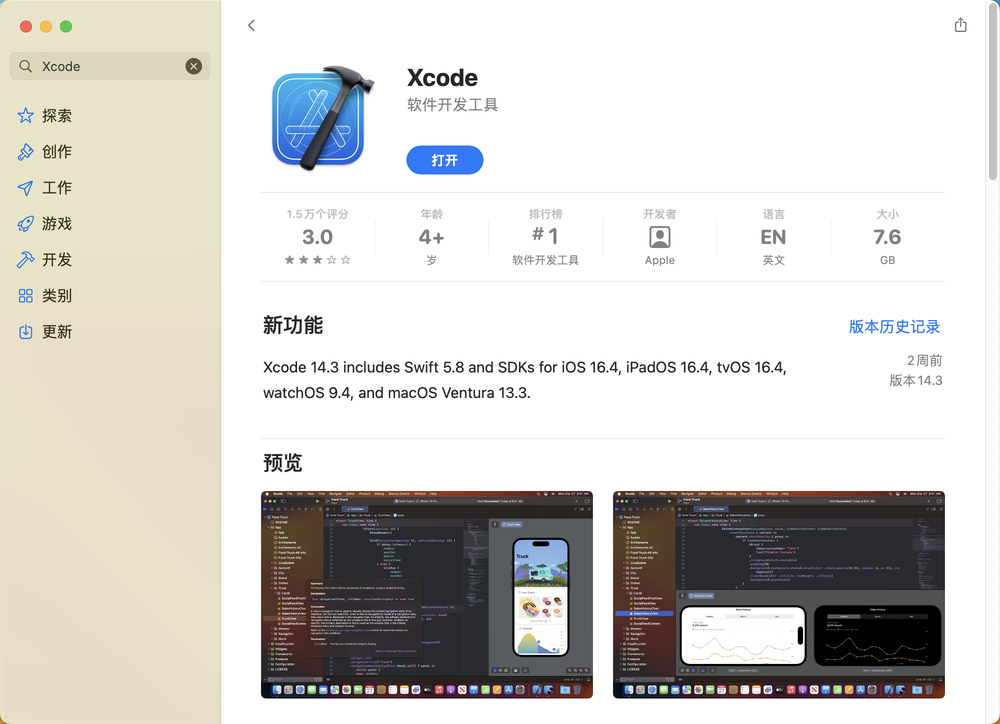

## QT基本介绍

<!-- <div  align="center">    
 
</div> -->


### 1 背景信息
- 官网：https://www.qt.io/
- 下载：https://download.qt.io/
- 跨平台可视化开发工具(Winows/Mac/Linux/Android/IOS)

- 有收费版和免费的开源版(Opensource distribution under an LGPL or GPL license)
- 免费版开发的桌面应用,发布时不要求开源,须带一些动态链接库,无法静态绑定到一个.exe文件
- Qt是核心库,类比Python
- QtCreator是IDE,用于开发桌面应用(如WPSoffice),类比Pycharm
- QtQuick可用于开发移动应用

### 2 Qt开发环境安装

这一部分介绍Qt开发环境在不同操作系统上的安装，主要是介绍通过**Qt在线安装程序**进行安装的过程。其他安装方式，例如直接下载完整安装包、从源代码编译Qt等方式在新版本Qt下使用的较少，有兴趣的同学可以进一步尝试。

Qt在不同的操作系统上依赖于不同的运行环境。在完成依赖环境的配置后，最新的Qt在线安装程序在不同系统上的安装过程是一致的。因此首先介绍不同操作系统上的依赖环境配置过程。

#### 2.1 Mac系统环境配置

##### 2.1.1 Xcode安装

Mac系统上安装Qt开发环境需要依赖于Xcode。因此首先需要进行Xcode的安装。在系统自带的App Store中搜索“Xcode”，点击“获取”-“安装”即可。




##### 2.1.2 Xcode路径配置（可选）

在不同的电脑上，Xcode的安装行为可能存在差异。在下一阶段真正启动Qt安装程序的时候，可能会出现下述报错：

> You need to install Xcode and set up Xcode command line tools. Download Xcode from https://developer.apple.com

这可能是因为Xcode没有被安装到正确的路径下导致的，下面提供一个路径配置方式，更多路径配置细节可以参考[官方文档](https://doc.qt.io/qt-6/macos.html
)。

使用xcode-select工具选择本机上的一个Xcode安装实例。
```shell
$ sudo xcode-select --switch /Applications/Xcode.app
```

检查上述命令是否成功进行Xcode安装实例选择。
```shell
$ xcode-select -print-path
/Applications/Xcode.app/Contents/Developer
```

#### 2.2 Windows环境配置

在Windows系统下不需要额外的依赖环境配置，直接启动Qt安装程序即可。需要提及的是，对于新推出的运行在ARM平台上的Windows系统，对于Qt的支持可能会存在兼容性问题。

#### 2.3 运行Qt安装程序

最新版本的Qt开发环境统一使用了在线安装包的方式进行安装，该在线安装包在不同系统上的操作方式是相同的，此处以Mac系统上的安装过程作为例子。

##### 2.3.1 下载在线安装包

前往[官方下载网站](https://www.qt.io/download-qt-installer-oss)，选择与自己的电脑对应的平台之后点击下载按钮即可。


##### 2.3.2 Qt账户注册/登陆

打开下载完的安装包，首先会进入Qt账户注册/登陆界面，按照提示进行账户注册、登陆即可。


##### 2.3.3 安装文件夹选择

不断选择下一步，直到进入安装文件夹选择界面，其中的安装选项直接选择"Qt 6.5 for desktop development"，因为我们需要在桌面环境下进行开发。


##### 2.3.4 组件下载与安装

选择下一步，安装程序会自动下载需要使用的组件并进行安装，等待安装完成即可。


##### 2.3.5 安装完成

以上步骤全部完成后，打开Qt Creator，即可创建Qt工程并进行开发了。


### 3 第一个Qt桌面工程

#### 3.1 创建工程
1. 运行Qt Creator

2. 新建Qt Widgets项目（即带窗口界面的项目）

3. 指定文件夹和项目名称

4. 指定一个源文件中的类名以及其基类(后面使用hellodialog)

5. 工程创建完成


#### 3.2 Qt项目文件组成

- helloworld.pro 项目文件
- hellodialog.h用户自定义类的头文件
- hellodialog.cpp 用户自定义类的源文件
- main.cpp 程序的入口文件, 包括main函数
- hellodialog.ui程序的界面文件 (XML格式, 只能可视化编辑)

**hellodialog.h 用户自定义类的头文件**

```c++
#ifndef HELLODIALOG_H
#define HELLODIALOG_H
namespace Ui {// 界面的名字空间
    class HelloDialog;
}
class HelloDialog : public QDialog {
    Q_OBJECT; //宏定义
public:
    explicit HelloDialog(QWiget * parent = 0);
    ~HelloDialog();
private:
    Ui:: HelloDialog * ui;
};

#endif // HELLODIALOG_H
```

#### 3.3 发布Qt编写的可执行程序

1. 在左下角选择release版并编译,在release版文件夹下面得到.exe文件
2. 将以下.dll文件和.exe文件放在同一文件夹下一起发布
    - libgcc_s_dw2-1.dll
    - libstdc++-6.dll
    - libwinpthread-1.dll (也可能不要)
    - Qt5Core.dll
    - Qt5Gui.dll
    - Qt5Widgets.dll


### 4 样例代码目录

本网页提供了13个示例程序的讲解，点击下列链接，访问每个实例的具体文档。

- [示例0 Qt工程的创建](https://pkupop.github.io/QT-page/sample0)
- [示例1 新窗口的创建](https://pkupop.github.io/QT-page/sample1)
- [示例2 修改窗口的大小和形状](https://pkupop.github.io/QT-page/sample2)
- [示例3 模态与非模态对话框](https://pkupop.github.io/QT-page/sample3)
- [示例4 信号和槽（手动关联）](https://pkupop.github.io/QT-page/sample4)
- [示例5 信号和槽（自动关联）](https://pkupop.github.io/QT-page/sample5)
- [示例6 编辑槽映射](https://pkupop.github.io/QT-page/sample6)
- [示例7 常用对话框介绍](https://pkupop.github.io/QT-page/sample7)
- [示例8 常用组件介绍](https://pkupop.github.io/QT-page/sample8)
- [示例9 常用按钮介绍](https://pkupop.github.io/QT-page/sample9)
- [示例10 常用输入框介绍](https://pkupop.github.io/QT-page/sample10)
- [示例11 Spinbox和Datetime edit](https://pkupop.github.io/QT-page/sample11)
- [示例12 Slider和Dial](https://pkupop.github.io/QT-page/sample12)