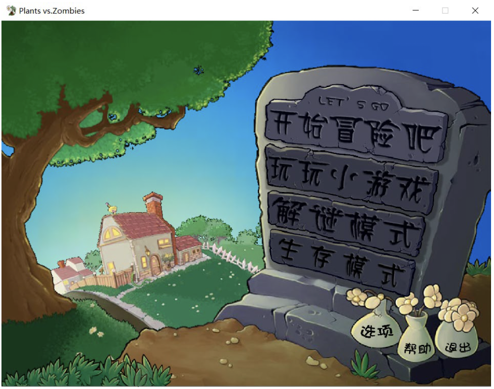
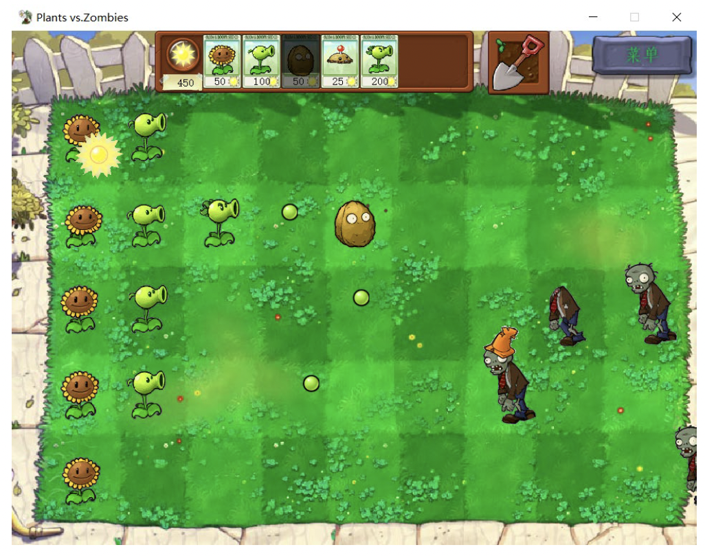

## 基于 qt 的植物大战僵尸复刻

<!-- [项目演示视频链接](http://39.96.165.147/Projects/QT-video/project_0.mp4) -->

### 项目演示视频

<video src="http://39.96.165.147/Projects/QT-video/project_0.mp4" width="720" height="480" controls autoplay preload="auto">
</video>

### 队伍成员

组长：郝昕

组员：马子豪 彭毅诚

### 功能介绍

程序核心的目的在于利用qt内部的函数与类以及通过解包原版植物大战僵尸而获得的图片、音乐等素材进行对植物大战僵尸最基本的功能的复刻，按照结构而言，本程序可分为两个模块，分别为菜单模块和游戏主界面模块，以下将分别就这两部分进行说明。

#### 菜单模块

菜单模块中主要实现的功能包括：菜单按钮动效的实现，主菜单上所有按钮的反馈以及异形弹窗的实现。特别的，相较于传统qt程序，我们认为全异形弹窗是我们程序的一大亮点，整个程序内除了主窗口外，所有的弹窗全部都是以异形窗口且可任意拖拽的，这一点在菜单页面中尤为突出。

#### 游戏模块

游戏模块基本实现了原版植物大战僵尸的所有功能，包括植物的种植、僵尸受击、植物受伤以及僵尸的各种动作变化等等，碍于时间关系，我们只实现了5种不同的植物和4种不同的僵尸，同时也只实现了一个关卡，但是程序本身具有良好的可扩展性，无论是加入新的植物，异或是增加新的关卡，操作都十分简单。

### 模块与设计细节

项目主题是由一个mainwindow类所构成的，其中mainwindow有且只有一个子控件，即stackedwidget，游戏的开始与退出围绕着stackedwidget的setcurrentindex函数进行。开始界面与游戏界面分别为stackedwidget的两个子控件。

#### 开始界面

开始界面MyMenu是一个以QWidget为基类的类，其中重载了paintevent并且在构造函数中对其应有的各个按钮进行了布局。在开始界面中，主要使用的有两个自定义的类，分别为MyPushButton与ShapedWindow。

**MyPushButton类**

MyPushButton是一个以QPushButton为基类的自定义类，其对不规则按钮应该实现的一些功能进行了封装，包括遮罩的设置、边框消除以及按下按钮应该发生的动画、音效等等。同时类内也提供了两种不同的按钮实现，用于创造有浮动效果和没有浮动效果的两种按钮。

**ShapedWindow类**

ShapedWindow是专用于新建异形窗口的自定义类，以QMainwindow为基类，通过设置窗口形式为无边框，以及设置样式表的方法实现异形窗口，再通过重载鼠标按下、释放和移动的时间实现对窗口的拖动。

#### 游戏界面

游戏界面主要由返回按钮，种子库、铲子、植物和僵尸组成，其中返回按钮沿用了菜单中的MyPushButton类，在此不再赘述；而植物并没有进行封装，而是通过QLabel类直接实现，下面我们分别就这几个部分进行设计介绍。

**种子库与铲子的实现**

种子库Seed类和铲子Shovel类都是以QPushButton为基类的自定义类，在类中主要实现了鼠标图片的改变和与项目内植物、阳光等等数值的关联。通过链接cliked事件与场景内变量isplanting，我们实现了对植物大战僵尸中种植植物方式的完美复刻。

**僵尸的实现**

僵尸用基于QLabel类的Zombies类封装，在类中实现了僵尸的行走、啃食、死亡、受击动作，以及僵尸暂停和恢复。其中僵尸的死亡由游戏界面中的监视器监视，僵尸的生成也由游戏界面中的生成器随机生成。

**植物的实现**

植物的实现通过二维整型数组储存地图中植物的种类和生命值，基于QLabel类实现植物的动画效果，通过鼠标捕获实现玩家种植植物的交互功能，通过定时器和定时器嵌套的应用来实现豌豆射手的攻击、土豆地雷的定时爆炸等，并且能够与僵尸进行交互。

### 本项目代码下载链接

[代码下载链接](https://github.com/YuIcy/PlantsVSZombies)