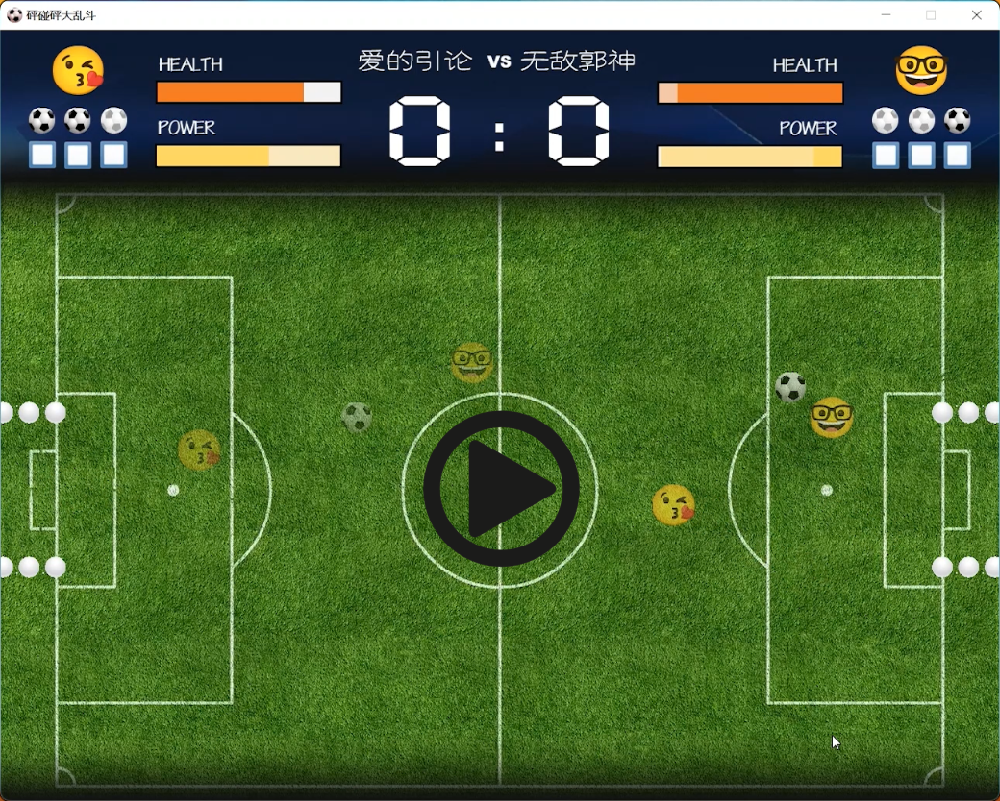
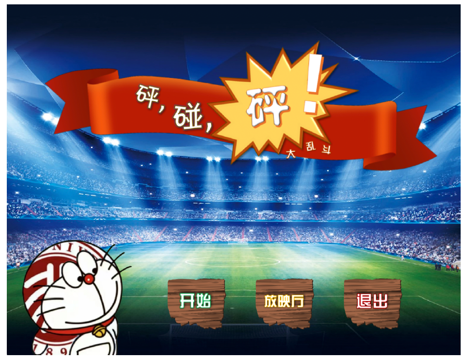
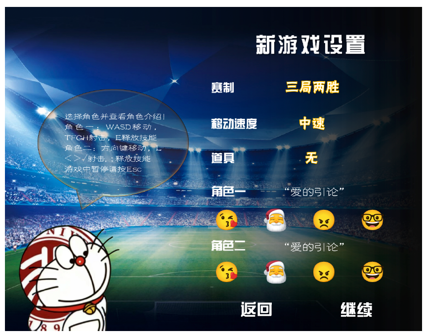
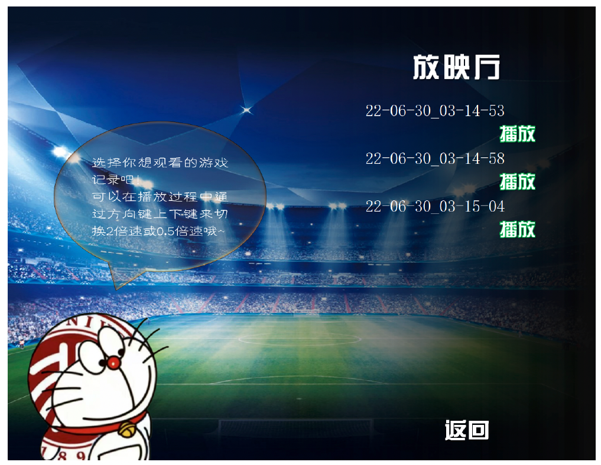
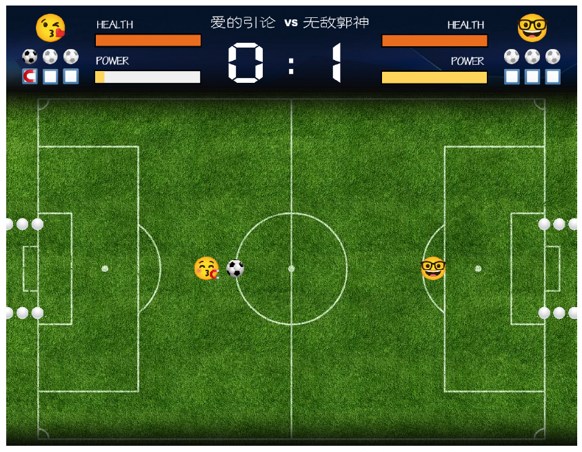
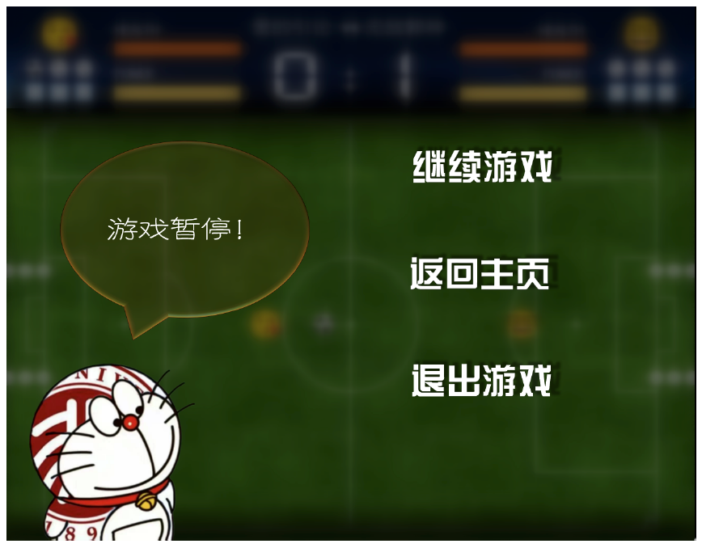
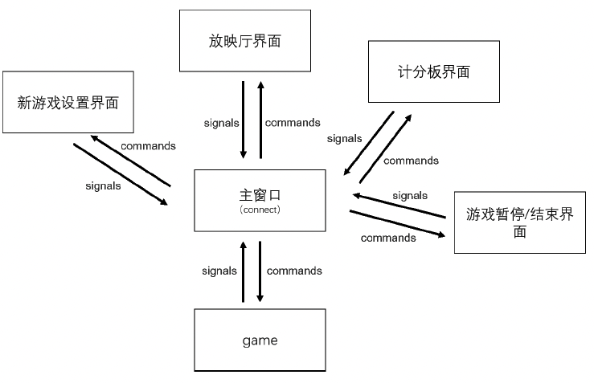

<!-- ## 基于 QT 的植物大战僵尸复刻 -->

<!-- [项目演示视频链接](http://39.96.165.147/Projects/QT-video/project_0.mp4) -->

### 项目演示视频

<!-- [项目演示视频链接](http://39.96.165.147/Projects/QT-video/project_0.mp4) -->

### 队伍成员

组长：汪逸阳

组员：徐浩哲 苏驰

### 功能介绍

我们实现了一个小游戏“砰碰砰大乱斗”，这是一个二人本地对战游戏，双方可以选择四种各具特点的角色在足球场上进行一场混乱而又欢乐的足球战斗。

游戏的目标自然是向对方球门中打进足球从而累计到一定得分而取胜，但是玩家不仅可以直接用角色顶球来控球，还可以向八个方向发射投掷物来推动足球；不仅可以用投掷物攻击对手从而使其生命值清零后下台数秒来为自己创造控球环境，还可以积攒技能条，在恰当的时候使用各角色独有的技能一转局势！玩家还可以选择是否开启道具模式，道具模式将在场中央随机投放各种道具，增加局面的不确定性。

我们的小游戏还带有游戏对局的记录功能，一局完整的游戏正常结束后，对局记录将被自动保存。玩家可以从主菜单进入放映厅查看最近六条完整游戏对局的记录并播放任意一条记录，游戏对局记录忠实的还原了对局的一切信息，玩家还可以调整2 倍速或者0.5 倍速来播放对局，方便复盘。

### 类设计细节

#### 游戏内核对象（Game）
Game 类继承自Qt 的内部类QGraphicsScene，Qt 的这个类的作用就是将QGraphicsPixmapItem类(我们游戏的GameObject 类就由此类派生，以下我们把其所有的派生类均称为GameObject 类) 的对象刷新到屏幕上。由于游戏内核对象的构成与工作机理比较复杂，接下来只阐述核心机制。

**与另外两个模块的信息交换概述**

游戏内核Game 是整个程序的信息中转站，与另外两个模块均有信息交换。

对游戏物品模块而言，游戏内核对游戏内物品模块是不可见的，所以并没有给游戏物品模块留下接口， 它仅调用游戏物品模块的接口。这两个模块仅通过GameObject 的指针链表list<GameObjects *> gameObjects 来共享物品资源，但这些对象的内部信息除了个别给出的接口外对游戏内核也都是不可见的。游戏内核通过遍历这个指针链表调用物品模块的若干接口来交换信息并决定行为。

对窗口模块而言，窗口模块对游戏内核是不可见的，因此游戏内核通过两个方式与窗口模块进行信息交换，一个是发射信号(Signal) 来通知窗口模块，另一个是留下接口函数供窗口模块调用。

**游戏的全局工作机理**

此处的游戏指的是狭义的游戏窗口，并不指我们整个游戏程序。在每一局新游戏中我们维护一个全局计时器，按照一个周期T 来调用同一个函数updateGame() 来更新游戏信息与画面，我们称一次更新为一帧，计时器可以暂停并且以新的周期重新运行，这为我们的游戏暂停与录播倍速提供了方法。

在一局游戏刚开始的初始化阶段，游戏内核调用GameObject 相关类的构造函数设置玩家、球与障碍物的初始位置并将其加入gameObjects 链表中，初始化全局计时器、记分板与录播相关的信息等。

**录播的工作原理**

我们的录播并未记录游戏的画面信息，注意到游戏在每一帧的状态仅由上一帧的状态与玩家的操作状态决定(道具的生成是伪随机的，因此也是确定的状态)，因此我们只要记录了游戏的初状态与每一帧的玩家操作集合，我们就可以让三个模块共同完全一致地模拟出一局游戏的状态，故我们直接记录了一局游戏的设置状态和所有的玩家操作集合并写入了录播文件中，在录播模式中我们直接读取这个文件并按帧读取计算即可。

#### 游戏内物体

GameObject 和游戏内核Game 交互有且仅有四种接口，分别是是updateInGame()，player-Act(ActionSet action)，getGeneratedObjects() 以及若干个信息的get、set 与judge 函数(如getHealth(),setVelocity()，collideJudge(GameObject*obj) 等)。

- playerAct(ActionSet action) 接收来自内核的操作集合，对玩家进行操作。
- updateInGame() 负责对物体进行更新，并将其绘制在画面中。
- getGeneratedObjects() 可以获取物体生成的新物体，比如发射出的子弹等。内核通过这个方法将新生成的物体加入到游戏当中。

核心信息的get函数即返回物体的成员变量信息，set函数为游戏内核提供了设置游戏对象的成员变量信息的方法，judge 函数让物品模块内部进行判定并决定行为。

每一帧，游戏内核会调用两名玩家的player-Act方法来操控玩家，然后遍历游戏对象，调用updateInGame()。这两个函数进而再去操控其它函数，从而实现游戏内物体的状态计算和更新。之后，游戏内核再调用getGeneratedObjects()，将新生成的物体加入游戏中。这样简洁的接口，保证了后端物理引擎和游戏内核的低耦合性，实现了良好的分工。

**基类：GameObject**

GameObject 是一个抽象类，继承自Qt 自带的QGraphicsPixmapItem 类，是所有游戏内物体（包括玩家，子弹，球，障碍物，道具）的基类，负责操作游戏中物体的状态，并且将其绘制在界面上。GameObject 定义了游戏内物体的一些共同属性和接口。

对于游戏中的五种不同物体（玩家，子弹，球，障碍物，道具），我们使用了五种不同的派生类，每一种都有各自独特的属性和方法，并且对于通用的接口，每一种派生类也有各自独特的行为（也即：基类中的碰撞、更新等虚方法会得到重写）。

**派生类：GamePlayer**

GamePlayer 代表玩家类。玩家一共有四种，每种有不同的技能，GamePlayer 是这四种玩家的基类，是个抽象类。

玩家类中新增了玩家种类、生命值、技能点、射击冷却、技能点回复冷却、玩家带有的Buff 等属性；增加了playerAct(ActionSet action) 方法，接收一个内核传入的操作集合，控制玩家进行操作；同时增加了skill() 这个纯虚方法，代表玩家技能。另外，为了使得磁铁Buff 能够生效，我们还为玩家类添加了magnet() 方法，用于吸引游戏中的球。

四种玩家均有各自的技能，也即每种派生的玩家类会重写skill() 方法。

**派生类：GameBullet**

GameBullet 代表子弹类。子弹可以对球和玩家造成击退，并对玩家造成伤害。

子弹类中新增了伤害值、消亡时间、子弹主人的指针（设定上子弹不能对主人造成伤害）等属性。

**派生类：GameBall、GameObstacle**

GameBall 代表游戏中的足球。游戏的目标就是将足球踢入对手的球门。

GameObstacle 代表场上的障碍物。游戏中的球门柱就是该类的对象。

**派生类：GameItem**

GameItem 代表场上的道具。道具被玩家捡起（碰撞）以后，会回复玩家生命值、技能值，或者给予玩家Buff。

道具类中新增了道具种类、场上存在时间、Buff 持续时间、生命值回复量、技能值回复量等属性。

#### 游戏窗口

考虑到Qt Designer 自带的控件样式比较单一，且使用Qt Designer 直接进行设计对自由度和效率均有一定影响，因此在制作图形化界面的时候采用的策略如下：

先用Photoshop、PowerPoint 进行窗口元素（背景、个性化的button 与label 等）的布局设计，得到预览效果图，经商讨、修改、通过后，再按照效果图将设计的元素（基本上）以图片的形式加入到窗口中（均直接通过代码实现，因此工程中没有加入.ui 文件），从而得到较美观的、符合游戏基调且总体风格统一的图形界面。

这些界面均由QWidget类派生出对应的窗口类，窗口中的button 和label 分别使用了由QPushButton 类和QLabel 类派生出的myBtn 类和myLabel 类，这些新的类加入了一些新的特性，比如点击的QPropertyAnimation 动画效果和音效，使得用户交互感增强。

**主界面**

程序加载完毕后，用户按键盘上下任意按键进入主界面（在此之前先显示pressanykeywindow，该窗口无实际功能，只是增加仪式感，故省略说明），主界面元素动态进入画面。主界面中央显示游戏名称。左下角是上下轻微浮动的北大特色的哆啦A 梦，这个角色的设计定位是贯穿整个游戏的游戏助手，会在需要的时候给玩家提供信息，详见下面几个窗口。右下角是“开始”“放映厅”“退出”按钮，点击后分别跳转到游戏设置界面、跳转到放映厅界面、退出游戏。

**新游戏设置界面（newGameSetting）**

进入新游戏设置界面，窗口元素动态进入画面。最开始哆啦A梦上方出现对话框，显示游戏提示。玩家在窗口右侧进行新游戏设置，可以更改“赛制”、“移动速度”、“道具”、“角色一”、“角色二”。在玩家进行游戏角色选择的时候，对话框会介绍相应角色的信息。玩家通过右下角返回主界面或开始游戏。

**放映厅（cinemaWindow）**

进入放映厅界面，窗口元素动态进入画面。每一次进入放映厅界面，程序都会扫描record 文件夹中的.dat文件，游戏记录保存在这些文件中。若无记录文件，哆啦A梦对话框出现无游戏记录的提示，若扫描到记录文件，哆啦A梦对话框出现选择游戏记录播放的提示，窗口右侧则依次出现记录名称和播放按钮，点击播放开始记录回看。玩家通过右下角返回主界面。

**游戏界面（计分板）（boardWindow）**

进入游戏界面后哆啦A 梦消失。这里的游戏界面窗口和game 其实是不同的模块，在进入游戏以及进入游戏回放时都会和game 同时出现，主要元素是画面上方的计分板，负责显示当前对局的相关信息。计分板中间显示本场比赛的对局双方角色名以及当前大比分，两侧分别是两个玩家的当前状态。以玩家一为例（左侧玩家）。左上角显示的是玩家形象，其下方显示当前小局进球数量，没进一个球时该处会有一个小球亮起，踢进三个球即为本小局胜者，再下方是三个buff 槽，玩家最多允许同时获得三个buff，获得的buff 显示在buff 槽中。右侧便是HEALTH、POWER 的信息条，根据当前玩家的HEALTH、POWER 值动态变化。

**游戏暂停/结束界面（pausewindow）**

游戏暂停和游戏结束的界面布局相似，实际
上使用的是用一个窗口。该窗口显示时哆啦A 梦
会重新弹出。在游戏中按Esc，进入暂停界面，哆
啦A 梦对话框提示游戏暂停，玩家可通过右侧三
个按钮选择“继续游戏”、“返回主页”或“退出游
戏”。游戏结束时自动弹出游戏结束界面，哆啦A
梦对话框提示可前往放映厅查看回放。右侧显示本
场比赛的胜者。玩家可通过右侧两个按钮选择“返
回主页”或“退出游戏”。

**跳转与交互**

图形化界面设计了不同的窗口来执行各自的功能，但实际上程序运行的时候只打开了myWindow主窗口，其余模块均在主窗口中初始化，以主窗口为parent，显示在其中，而窗口的跳转实际上是主窗口隐藏其元素后再进行别的模块的显示。这样的跳转方式方便了各个模块之间的信息交互。主窗口充当了窗口与窗口、窗口与game 之间信息交互的枢纽，主窗口可以监听各个模块的signal，也可以通过各个模块暴露出的函数接口去操控各个模块的行为，即信号与槽函数的connect 在主窗口进行，从而使各个模块之间信息互通，协调工作。

### 本项目代码下载链接

[代码下载链接](https://github.com/ateb14/QTproject)