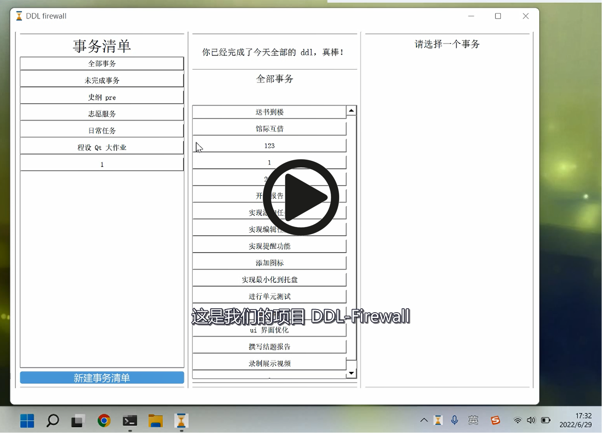

<!-- ## 基于QT的DDL管理器 -->

<!-- [项目演示视频链接](http://39.96.165.147/Projects/QT-video/project_3.mp4) -->

### 项目演示视频

<!-- [项目演示视频链接](http://39.96.165.147/Projects/QT-video/project_3.mp4) -->

### 队伍成员

刘胜与，谢安喆

### 项目介绍

#### 项目简介

本任务希望深度剖析当下大学生对“事务管理器”的需求，对做一款专门面向大学生的事务管理器。这就是 DDL Firewall。

#### 事务的分类

该项目把大学生活中常见的事务分成了两大类：

- 任务。这类事务可能有截止日期（俗称 DDL），一般以作业的形式呈现。
- 定时事务。这类事务往往有固定的起止时间（作为对照，上面的事务只有截止日期），这样的事务往往需要更精准的及时提醒。

#### 主要功能

我们的基本功能包括：

- 事务添加。新建一个事务，为其命名与添加描述。
- 事务的更改与删除。
- 事务的查看。
- 事务的提醒。对于定时事务，我们的软件将在其设定的特定时间进行提醒，对于不定时任务将采用其他方法进行提示。

除了上述基本功能，我们还提供了以下功能：

- 子事务。一个大事务可能包含不同步骤或不同模块，对于这样事务，我们常常希望对它们一同进行动态管理，避免遗忘同时进行计划。所以，在我们的软件中，一个事务可以有多个子事务（组织一次团建活动的各个步骤可以构成一个事务的子事务）。
- 事务清单。我们的应用会支持把不同的事务放在不同的“事务清单”内，方便用户进行管理。
- 日程的备份与导入。我们以可读且美观的 json 格式储存数据，方便用户进行备份与直接管理。

### 实现细节

#### 架构总览

我们采用了经典的前端 + 后端式架构。整个系统分为两大部分：前端与后端。后端负责维护、保存、处理数据（在本任务中即为清单、事务等），前端则负责提供图形界面，与用户交互。

#### 前端设计

##### 基本窗口

基于功能分类，我们创建了不同类型的窗口，利用 Qt 的各类控件，组合构建了主窗口（MainWindow）、编辑窗口 (Edit_...)、新建窗口（Add_...）等等. 按照我们的设计理念，我们希望简单呈现出各个功能，使用户能够方便的选择、浏览不同的任务清单、任务与任务详情。除主窗口外，整个程序涉及的其他窗口有如下 9 种：

- add_job
- add_sche_task
- edit_sche_task
- edit_job
- add_subtask
- edit_subtask
- add_reminder
- edit_reminder
- add_tasklist

##### Qt运用

软件利用了 Qt 的各种控件与其具有的方法组合实现了与用户的各类交互，利用信号与槽的机制实现了不同窗口或同一窗口中不同行为的链接。

##### 附加功能设计

- DDL-Counter：在主窗口的 Mid 部分显眼处告诉用户位于“今天”的 DDL还有多少
- 信息检查：为了筛选输入的信息，各个部分的信息输入在保存时将先进行检查
- 右下角托盘：我们支持将应用最小化到托盘，也可通过右下角托盘呼出或者关闭应用，我们对应用的运行进行了优化，使在最小化时其并不会占用太多电脑的性能
- 定时保存：每隔 5 min我们将对所有信息进行一次保存
- 显示优化：我们对 ui 进行了调整，让使用更加便利

#### 后端设计

##### 基本的类

我们在后端提供了五个主要的类：

- Reminder 类，代表一个提醒
- Subtask 类，代表一个子事务
- Task 类，代表一个事务
- Tasklist 类，代表一个事务列表（若干事务组成的集合）
- DataManager，负责维护所有的数据（包括但不限于所有的 Tasklist）与提供前端需要的 API

##### API

为了从根本上区分不同的元素，我们为每个元素都赋予了一个 UUID (通用唯一识别码, Universally unique identifier)，这样便能做到精确、高效的查找、筛选与删除。

##### 数据存取

使用 json 存储数据。

#####  unit-test

我们在本次的项目中引入了（较为）先进的 unit-test 技术。为了保证 json 存取的准确性，防止出现数据丢失等事故，我们构建了一系列 unit-test（自测试）。

### 本项目代码下载链接

[代码下载链接](https://github.com/interestingLSY/DDL-Firewall)