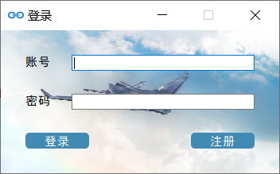

<!-- ## 基于QT的办公协作软件 -->

<!-- [项目演示视频链接](http://39.96.165.147/Projects/QT-video/project_4.mp4) -->

### 项目演示视频

<!-- [项目演示视频链接](http://39.96.165.147/Projects/QT-video/project_4.mp4) -->

### 队伍成员

金及凯 汪洋 潘世豪

### 功能介绍

本项目基于Qt开发了一款简易的办公协作软件。该软件分为线上聊天和发送文件，时间计划表，项目编辑等多个模块，为个人办公和团队合作提供了一个便捷的平台。下面将逐一介绍各模块的功能。

#### 注册和登录

由于办公协作软件一般支持多用户同时使用，在使用前就需要注册一个属于自己的账号。对于已经注册过的用户，则可直接在上面的登录界面中输入账号和密码。若登录成功则进入主界面。否则，会显示登录失败。

#### 添加好友和发消息

主界面中央会显示已添加的好友以及他们是否在线。上方的搜索框可用于搜索已添加过的好友；若想添加新的好友，可点击右上方的号，然后可在搜索框里搜索想要添加的好友的id。若该好友之前已添加过，则会跳出“请勿重复添加”的提示。添加好友后，便可向好友发送消息。点击好友头像后可进入聊天界面，在下方文本框里输入文字，然后点击“发送消息”即可（图为测试文件发送功能时的聊天记录）。点击左下方“发送文件”按钮，选择文件后即可发送。

#### 设定计划和时间计划表

点击主界面左边“设定计划”后会出现如下界面：

该界面中每一行对应一个事项，可设置开始时间，结束时间和事项名称。每天最多设置四项计划。点击“确认”后即完成设置。如果要查看已经设置过的计划，则可点击主界面左边“待办事项”按钮，会出现一个新界面，显示的是该用户设置过的全部计划。

#### 项目编辑

点击主界面左边的“项目编辑”按钮，便可进入项目编辑界面。该界面类似于记事本，有复制，粘贴，换行等编辑功能。在该界面中创建或编辑的文件也可保存到本地。

#### 个人名片

点击主界面左上角的头像，可查看个人名片，可通过更换头像和背景修改名片，同时支持修改密码，退出登录功能。

### 设计细节

#### 注册与登录

注册与登录功能在login和register两个类中实现。对于每个新注册的账户，我们将其账户信息存储到数据库中。我们建了一张user表专门用来存储用户信息。该表用于匹配注册和登录信息，以及主界面中显示在线状态，背景头像等，用户信息包括用户名，用户id，密码，状态（在线、离线），背景图片和头像。

#### 聊天和文件发送

基于TCP协议创建服务器类和客户端类（chat类和chatclient类）。客户端与服务器连接并实现聊天内容的相互传送。聊天界面会显示对方的在线状态，双方聊天记录和发送时间。其中，客户端负责包含用户基本信息，聊天窗口，在线用户，发送和接受消息。服务器端负责创建TCP连接，管理聊天信息，转发聊天消息。类似地，我们基于FTP协议实现了文件的发送和接受，由file类和fileclient类负责。

#### 设定时间计划表

在“设定计划”界面中设置的日程安排将会被保存到一个名为timetable的表中。每个事件都有一个id作为主键，“待办事项”界面将表中的信息全部显示出来。这一功能在ToDo和ToDoList中实现。

#### 添加好友

添加好友的信息将会被保存到relationship表中。为了查询方便，当id为i的用户添加了id为j的用户为好友时，我们将(i,j)和(j,i)都保存在表中。添加好友的功能在AddFriend类中实现。

### 本项目代码下载链接

[代码下载链接](https://github.com/ddlwarriors/Qt_officeCooperation)