## 示例0 创建Qt工程

[讲解视频链接](http://39.96.165.147/Projects/QT-video/sample_0.mp4)

本示例演示如何创建一个简单的Qt工程

- 基类的选择与区别
- Qt工程的文件结构
- 各种文件的代码解读
- 窗口界面的设计与修改

### 1 创建工程类选择

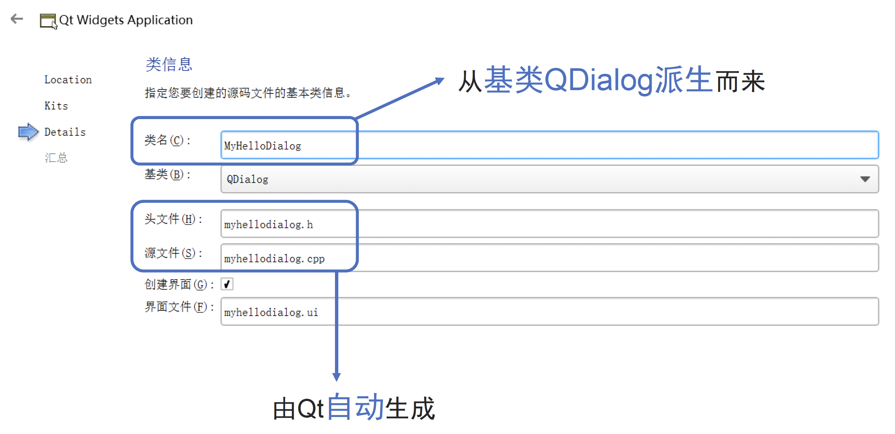

### 2 不同“基类”的差别

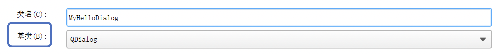

- **基类**有QMainWindow, QDialog, QWidget可选
- QWidget是其他两个类的基类, 较为通用
- QMainWindow是有菜单栏的窗口
- QDialog显示一个临时的对话框

### 3 Qt工程文件结构

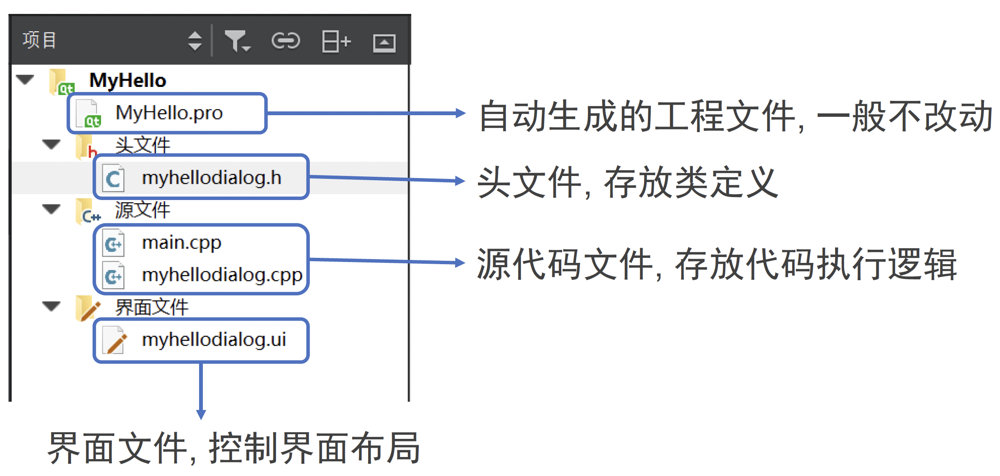

- .pro文件：自动生成的工程文件
- .h文件：存放类定义的头文件
- .cpp文件：存放代码执行逻辑的源代码文件
- .ui文件：控制界面布局的界面文件

### 4 头文件myhellodialog.h解读

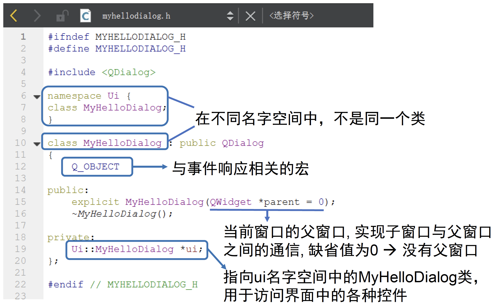

### 5 主函数main.cpp解读

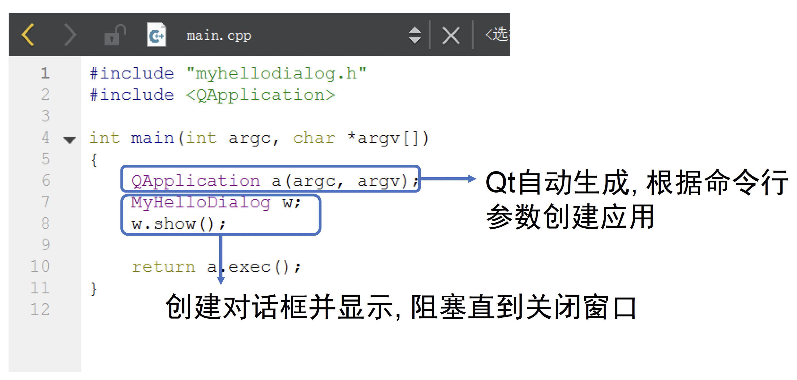

### 6 类函数myhellodialog.cpp解读

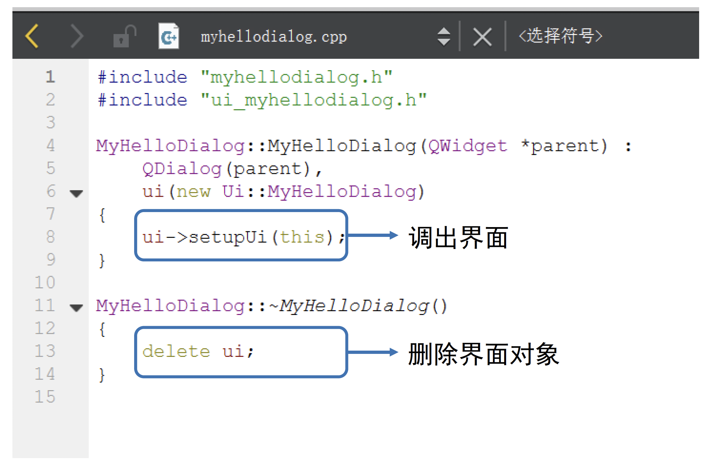

### 7 窗口界面编辑

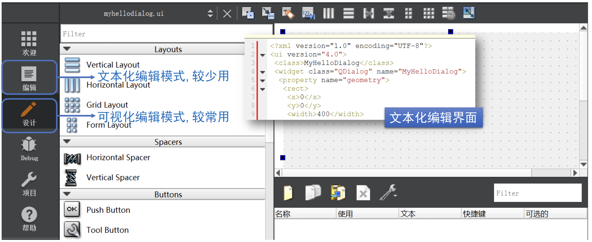

界面布局功能提供了两种窗口界面编辑模式：
- 文本化编辑模式
- 可视化编辑模式

#### 7.1 窗口添加新组件

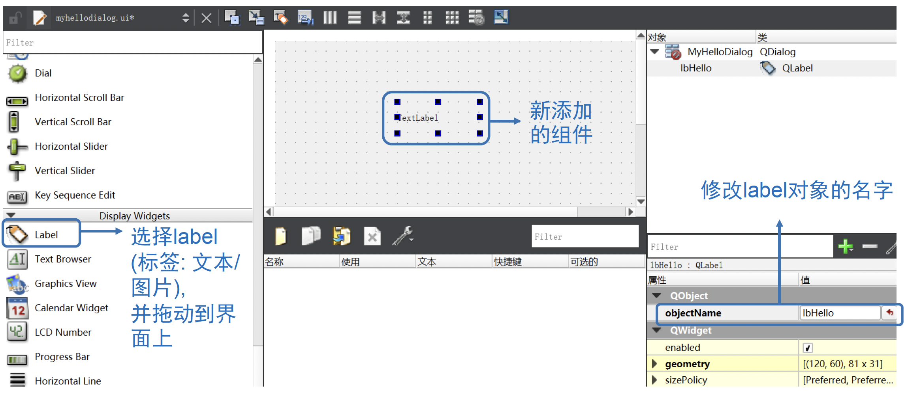

#### 7.2 修改组件内容(通过代码)

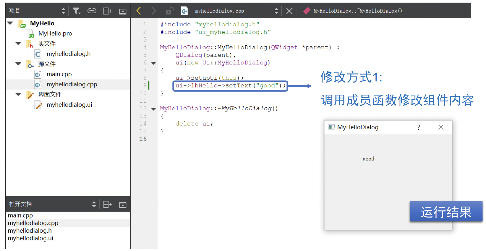

#### 7.3 修改组件内容(通过属性栏)

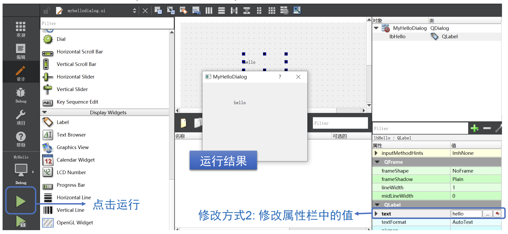

**属性栏修改组件后myhellodialog.ui内容的变化**
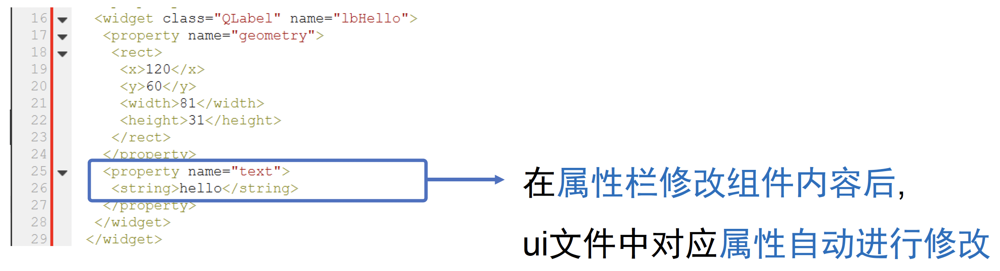

