## 示例1 创建窗口

本示例演示如何创建一个简单的Qt窗口

- 不用界面文件创建窗口
- 直接使用界面文件创建窗口

### 1 不用界面文件创建窗口

在这个例子中, 把窗口定义、显示的代码全部写到了 main.cpp中，即不使用界面文件创建窗口

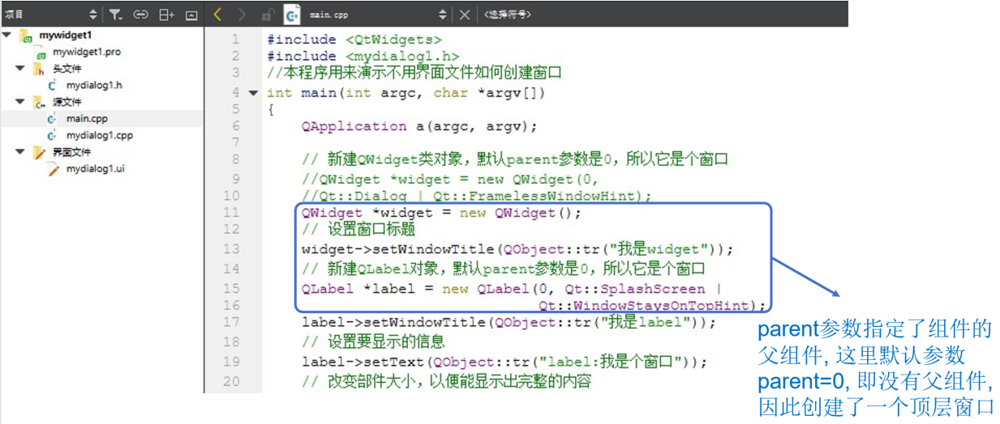

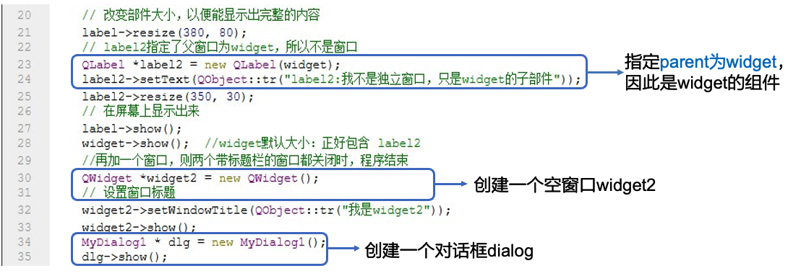

**以上创建代码的创建结果**

- “Widget2”是一个独立窗口
- “label”是一个窗口
- “我是widget”是一个窗口, 其中label2是它的部件
- Dialog是一个对话框

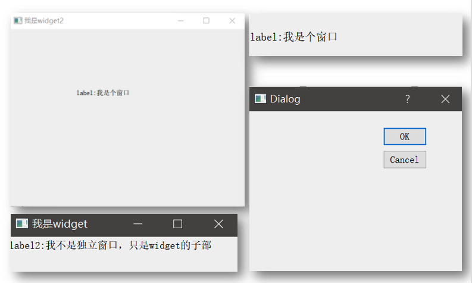

### 2 直接使用界面文件创建窗口

更常用的创建窗口的方法是：定义一个自己的类，如MyWidget，然后在构造函数和类函数中去自定义该窗口的各种属性。

在以下的例子中，将演示如何定义一个Mydialog1类，创建使用界面，可以直接用界面文件 (可以更方便的设计ui)

#### 2.1 新建界面文件

##### 点击“新建文件或项目”

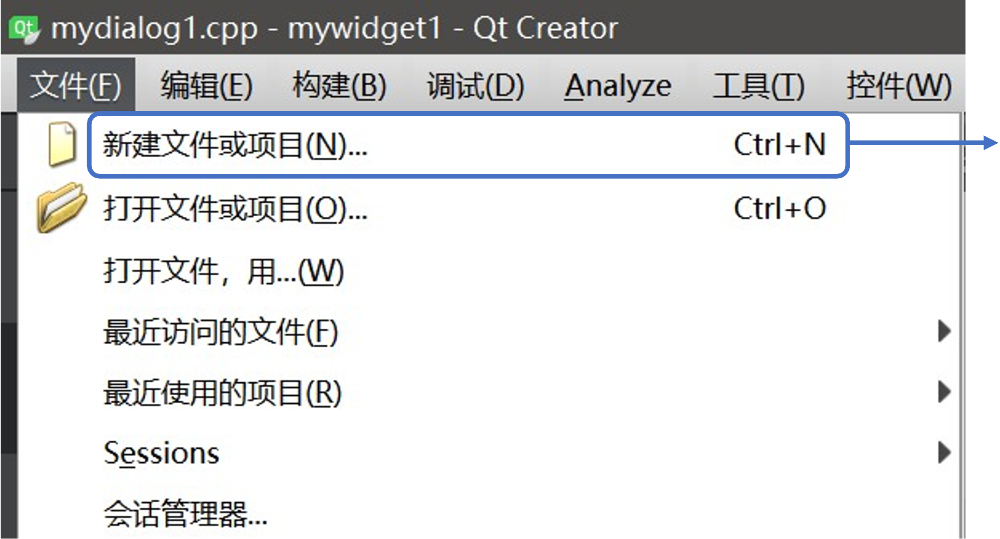

##### 选择“Qt 设计师界面类”

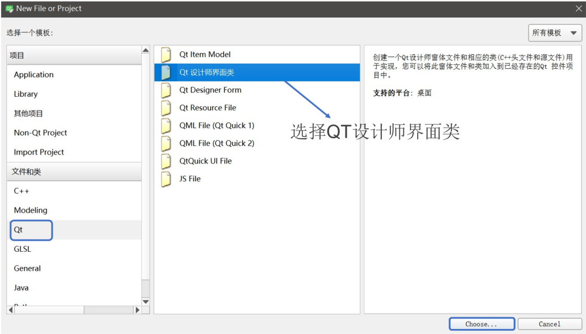

##### 根据需求选择界面模板

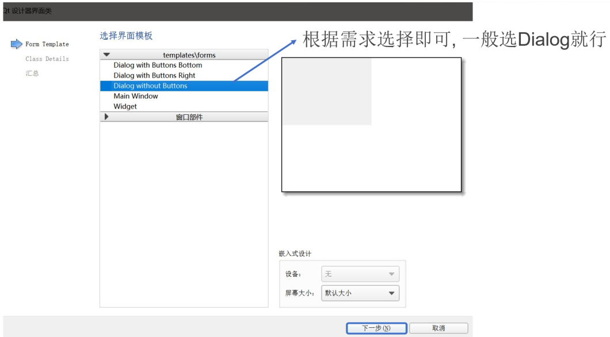

##### 为新定义窗口类取名

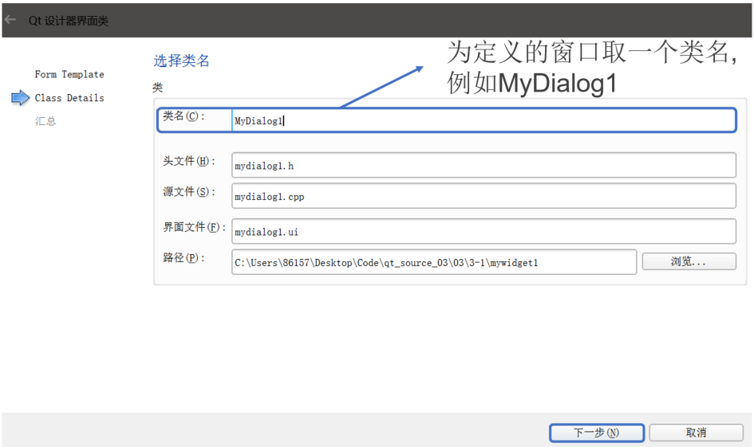

##### 使用默认设置完成创建

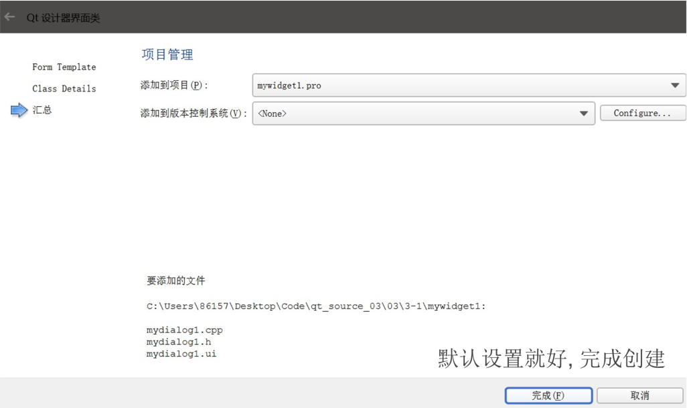

#### 2.2 进行ui设计

双击界面文件夹下的.ui文件可以设计ui

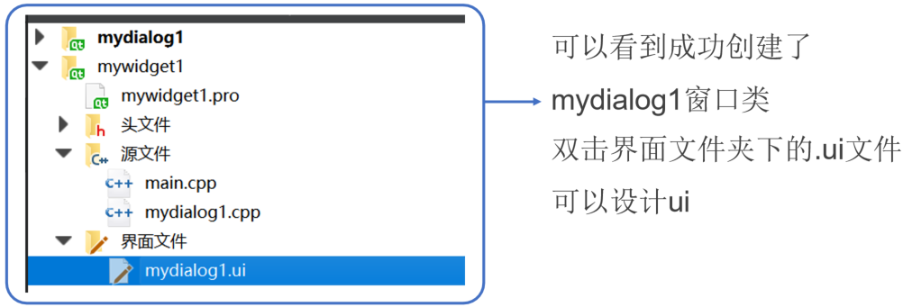

ui界面如下，可以鼠标选择一些控件然后设计窗口，设计完毕保存即可

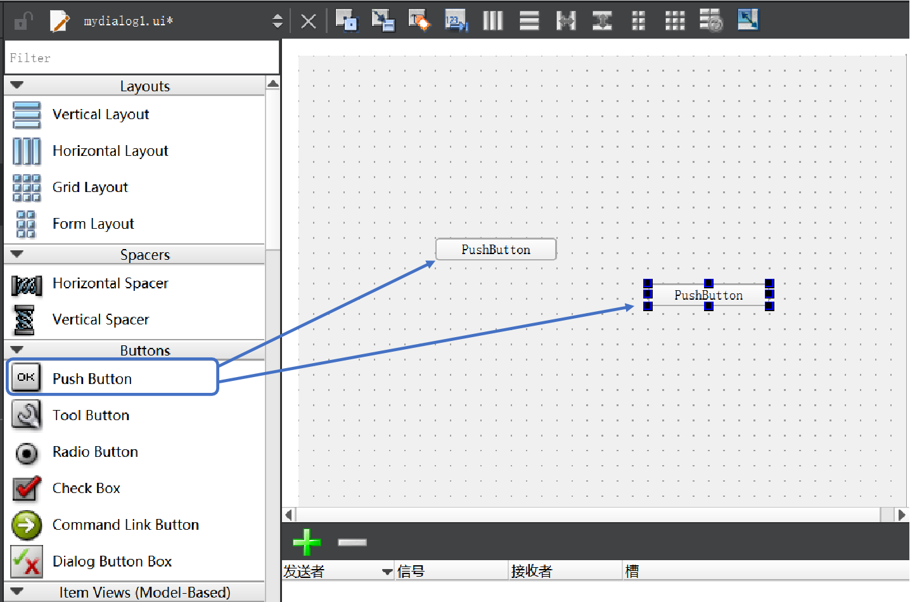

#### 2.3 界面文件使用

在main函数里就可以直接使用定义好的MyDialog1类。

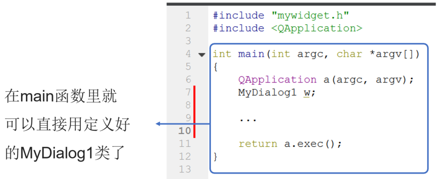