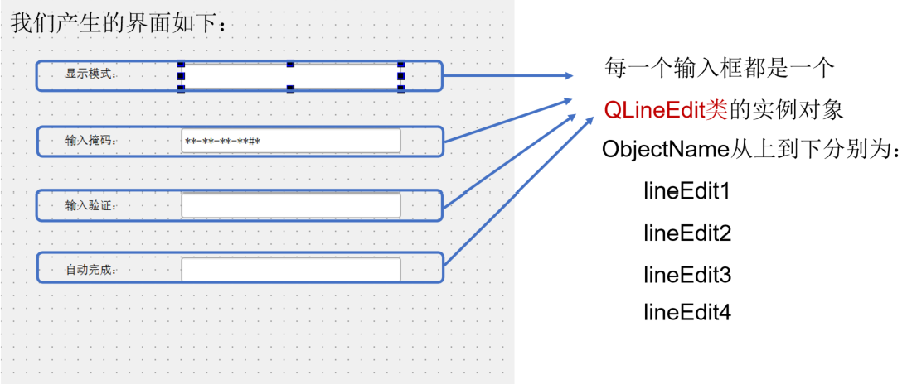
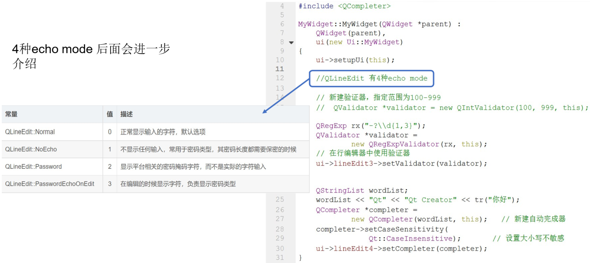
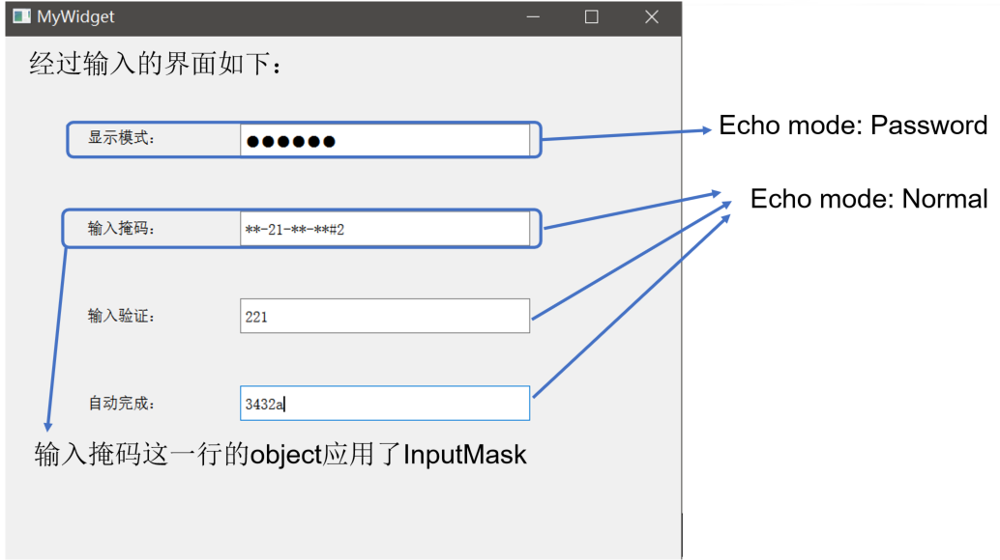
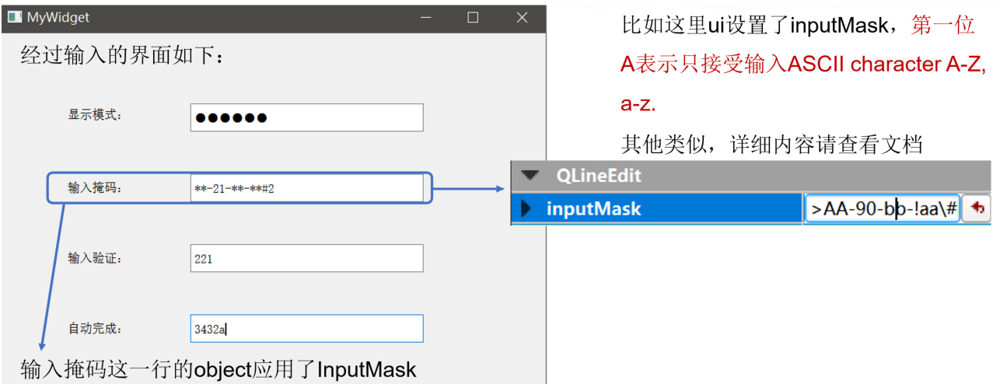
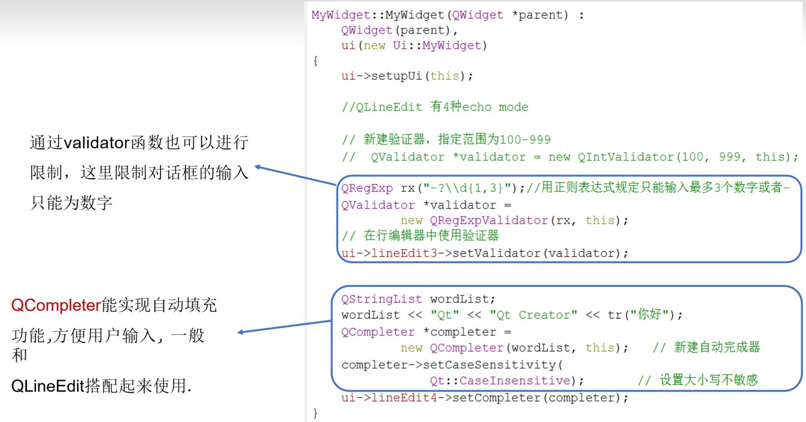
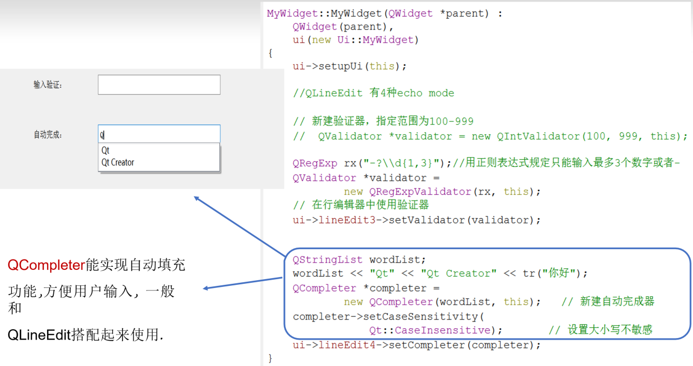
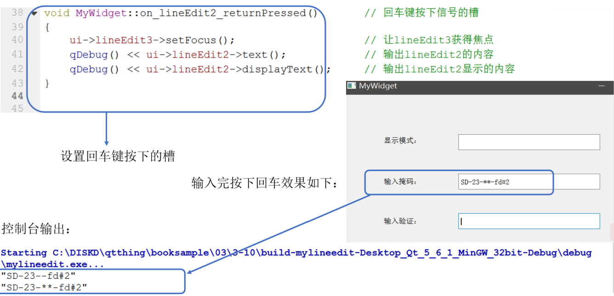

## 示例10 常用输入框介绍

本示例将演示不同的输入框

### 1 QLineEdit

#### 1.1 简介

1. QLineEdit是一个单行文本输入框，带有撤销、剪切、粘贴以及拖拽等功能。
2. 通过改变输入框的echoMode()，同时也可以设置为一个“只写”字段，用于输入密码等。
3. 文本的长度可以被限制为maxLength()，可以使用一个 validator()或inputMask()来任意限制文本。

#### 1.2 使用QLineEdit

QLineEdit::setInputMask(const QString & inputMask)方法可以使Edit控件只允许输入自定义的格式字符串，inputMask参数设置格式化字符串的掩码。

比如这里ui设置了inputMask，第一位 A表示只接受输入ASCII character A-Z, a-z.

其他类似，详细内容请查看文档

通过validator函数也可以进行限制，这里限制对话框的输入只能为数字

QCompleter能实现自动填充功能,方便用户输入, 一般和QLineEdit搭配起来使用.

