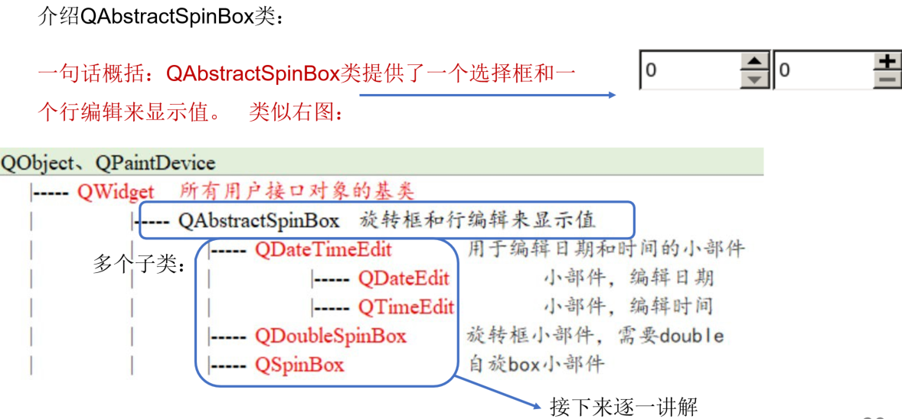
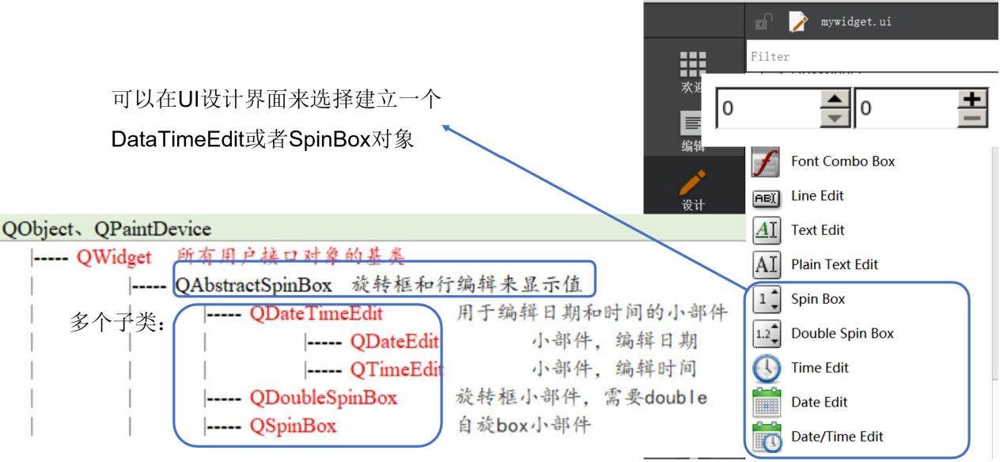
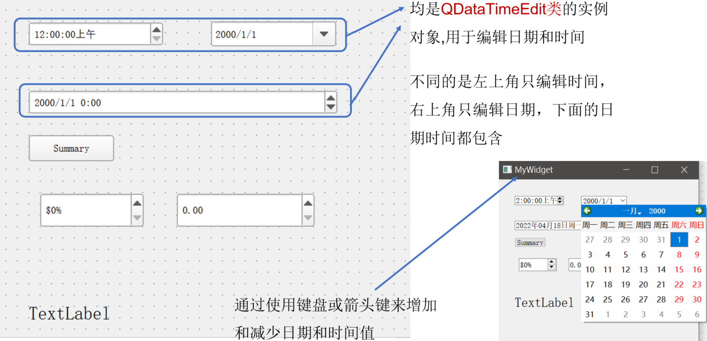
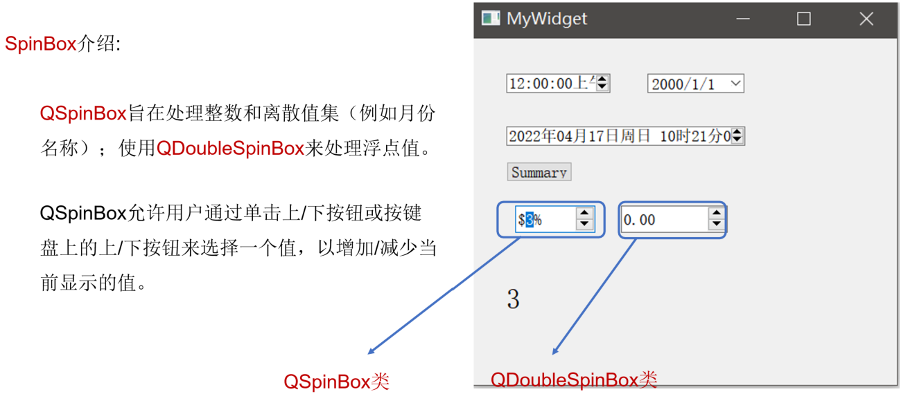
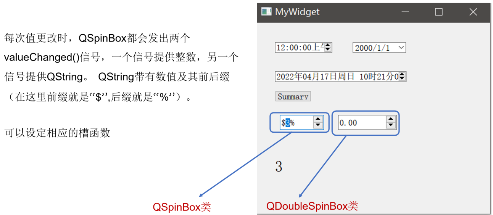
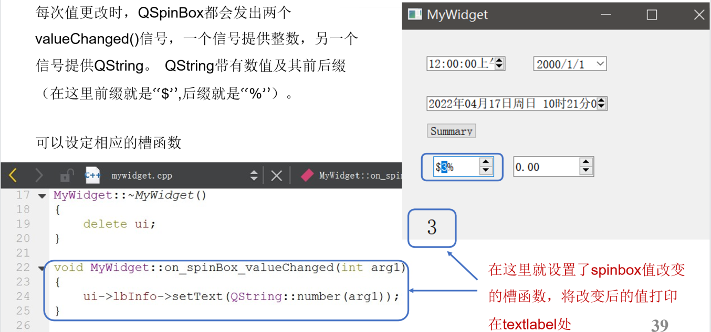

## 示例11 Spinbox和Datetime edit

本示例将演示Spinbox和Datetime edit的使用

### 1 QAbstractSpinBox

一句话概括：QAbstractSpinBox类提供了一个选择框和一个行编辑来显示值。

我们的程序产生的界面如下，均是QDataTimeEdit类的实例对象，用于编辑日期和时间

拓展：此外还可以设置日期、时间显示格式、选择弹出日历、设置日期时间改变时的槽函数等等。这些均与之前讲过的设置类似，详细可参考：

- https://doc.qt.io/qt-5/qdatetimeedit.html
- https://blog.csdn.net/liang19890820/article/details/52387275

### 2 SpinBox

#### 2.1 简介

- QSpinBox旨在处理整数和离散值集（例如月份名称）；使用QDoubleSpinBox来处理浮点值。
- QSpinBox允许用户通过单击上/下按钮或按键盘上的上/下按钮来选择一个值，以增加/减少当前显示的值。

每次值更改时，QSpinBox都会发出两个 valueChanged()信号，一个信号提供整数，另一个信号提供QString。QString带有数值及其前后缀（在这里前缀就是“$”,后缀就是“%”）。

拓展：QT提供了多个函数接口可以实现设置步长、字符串到数值的转换、开启循环、默认值等等功能。详细请参考：

- https://doc.qt.io/qt-5/qspinbox.html
- https://blog.csdn.net/YinShiJiaW/article/details/104896416