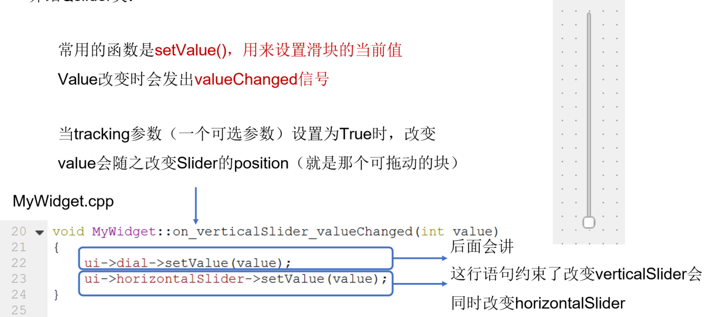
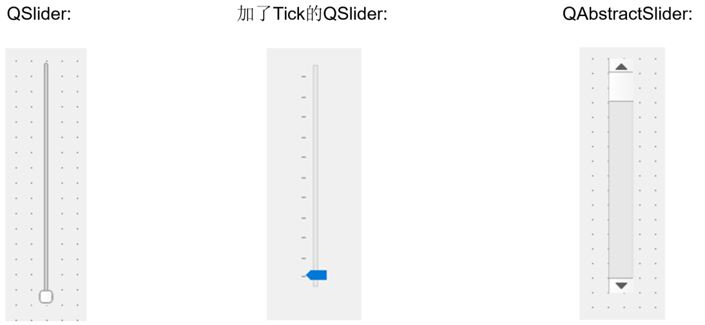
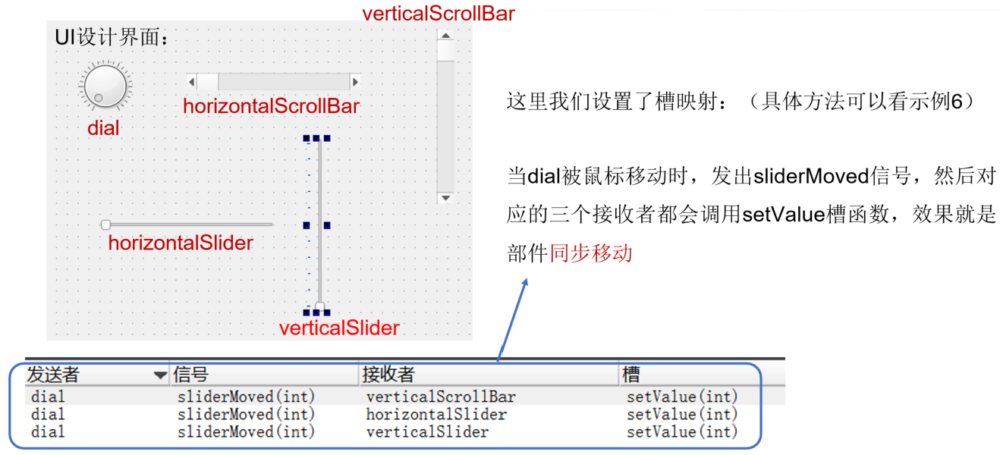
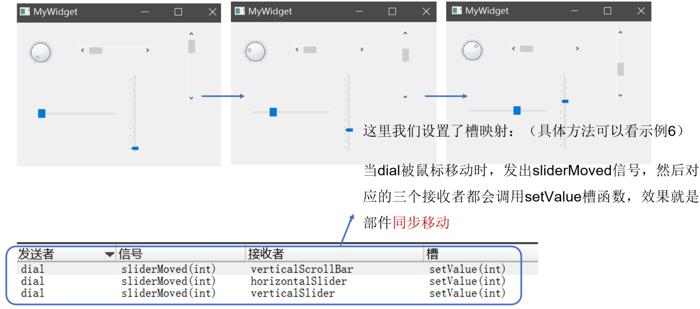

## 示例12 Slider和Dial

本示例演示了Slider和Dial的使用

### 1 Qslider

QSlider部件提供了一个垂直或水平滑动条。滑块是一个用于控制有界值的典型部件。它允许用户沿水平或垂直方向移动滑块，并将滑块所在的位置转换成一个合法范围内的值。

常用的函数是setValue()，用来设置滑块的当前值。Value改变时会发出valueChanged信号

当tracking参数（一个可选参数）设置为True时，改变value会随之改变Slider的position（就是那个可拖动的块）

QSlider类是QAbstractSlider类的子类，QSlider类又增加了刻度可选功能TickPosition

### 2 QDial

#### 2.1 简介

和QSlider类似，Qdial也是QAbstractSlider的子类。QDial类提供了四舍五入的范围控制（如速度及或者电位计），有一定刻度的圆形控件

关于信号：

- 移动滑块时，sliderMoved信号发出
- 没有禁用跟踪tracking属性时，valueChanged信号一起发出
- 按下/释放鼠标按钮时，转盘发出SliderPressed和 SliderReleased信号

#### 2.2 使用QDial

这里我们设置了槽映射：（具体方法可以看示例6）

当dial被鼠标移动时，发出sliderMoved信号，然后对应的三个接收者都会调用setValue槽函数，效果就是部件同步移动

拓展：更多内容可参考： 

- https://doc.qt.io/qt-5/qdial.html 
- https://doc.qt.io/qt-5/qslider.html

### 本示例代码下载链接

[代码下载链接](https://github.com/PKUpop/QT-page/raw/main/code/12.zip)