## 综合示例 反应力测试小游戏

<a href="http://39.96.165.147/Projects/QT-video/sample_13.mp4">
    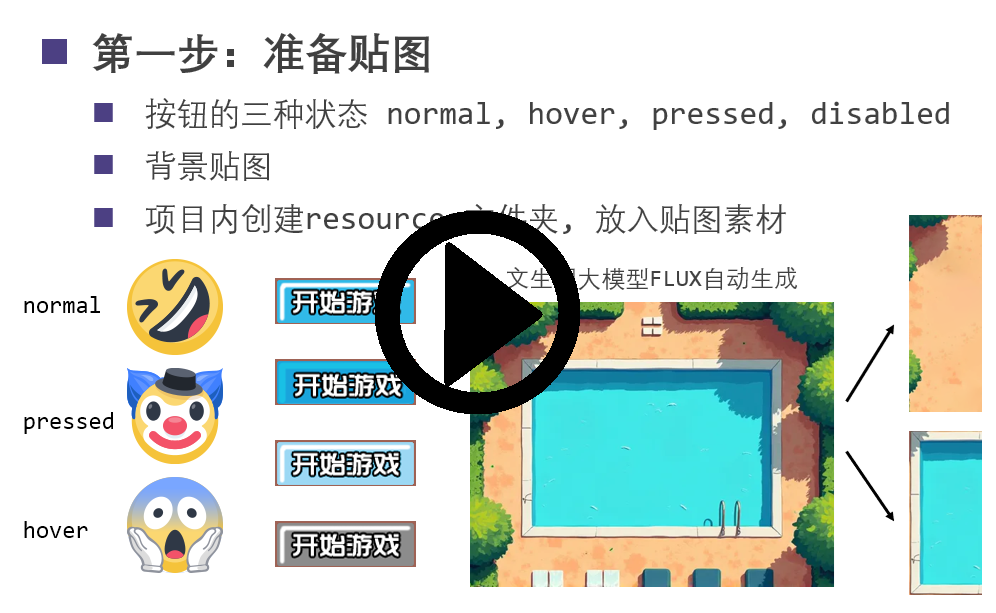
</a>

本示例演示如何制作一款反应力测试小游戏

- 展示窗口和组件创建及基本样式
- 按钮位置动态调整逻辑
- 计时器 QTimer 与进度条同步
- 自定义类提升与动画 QPropertyAnimation
- 通过 Qt 资源文件 (.qrc) 美化界面

### 1 展示窗口和组件创建

首先使用 Qt Designer 设计界面，UI 逻辑关系如下：

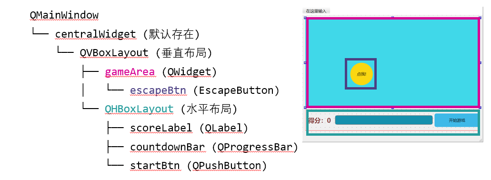

添加组件后，使用样式表（StyleSheet）进行初步美化：

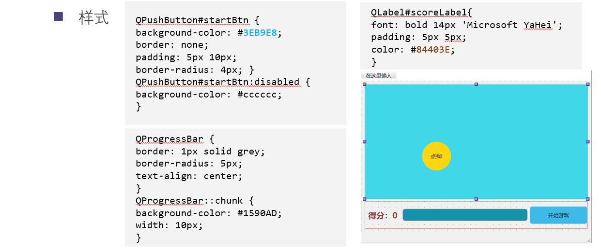

### 2 按钮位置动态调整

给窗口添加全局状态变量 `score`，实现点击按钮后得分增加并随机移动位置。

#### 2.1 添加全局状态
- 在 `mainwinow.h` 定义变量
- 在 `mainwinow.cpp` 初始化

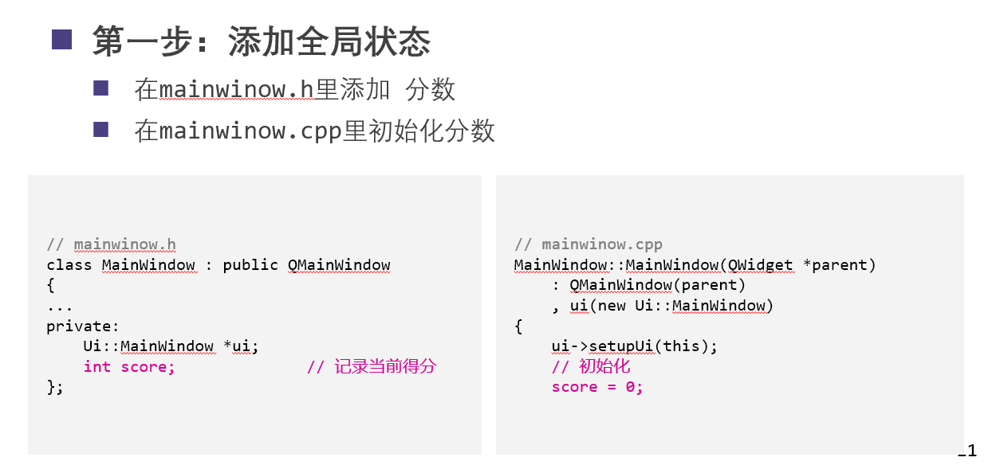

#### 2.2 编写按钮点击事件
利用 `move()` 函数配合随机数修改组件坐标。

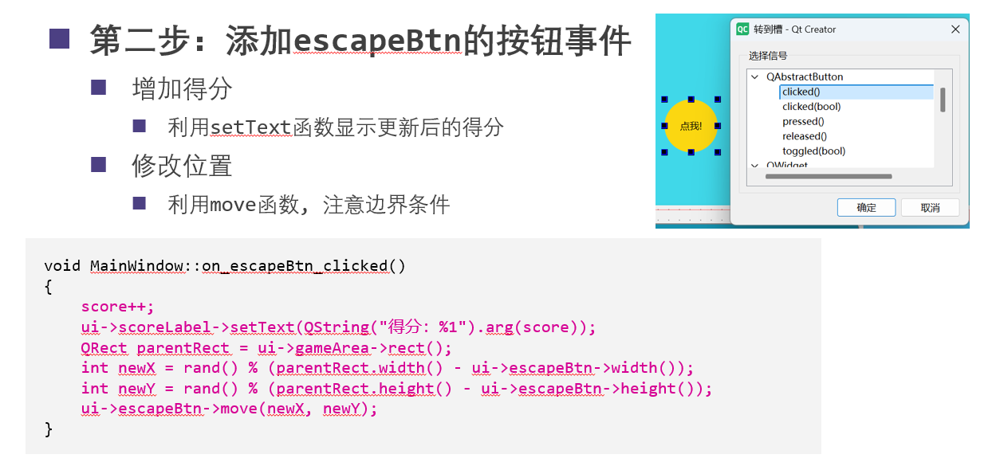

### 3 计时器和倒计时进度条

#### 3.1 扩展全局状态
添加剩余时间 `remainingTime`、总时间常量以及 `QTimer` 定时器。

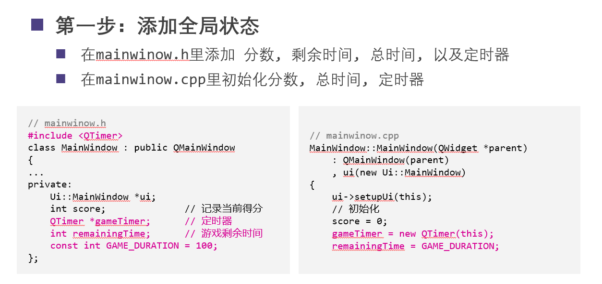

#### 3.2 开始按钮逻辑
点击“开始游戏”后，初始化数据并启动定时器。

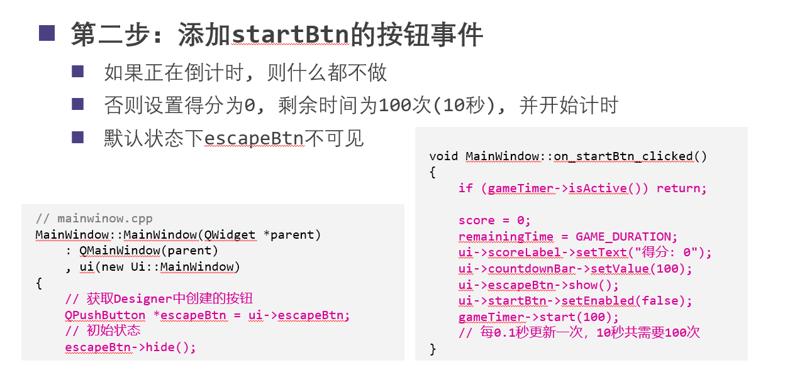

#### 3.3 定时器槽函数与信号连接
编写 `updateTimer()` 槽函数更新 UI，并使用 `connect()` 连接信号。

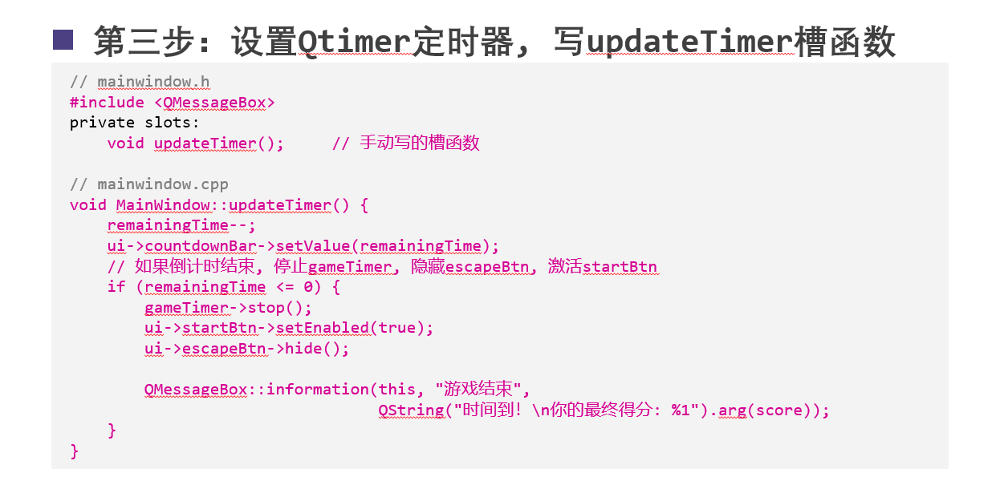

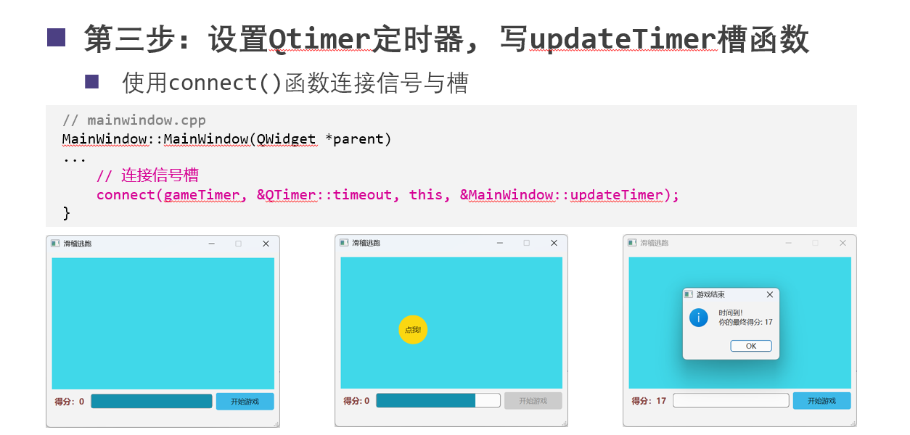

### 4 自定义类与动画重载

新建 `EscapeButton` 类并重载 `enterEvent`，实现鼠标进入时按钮平滑滑走。

#### 4.1 新建 EscapeButton 类

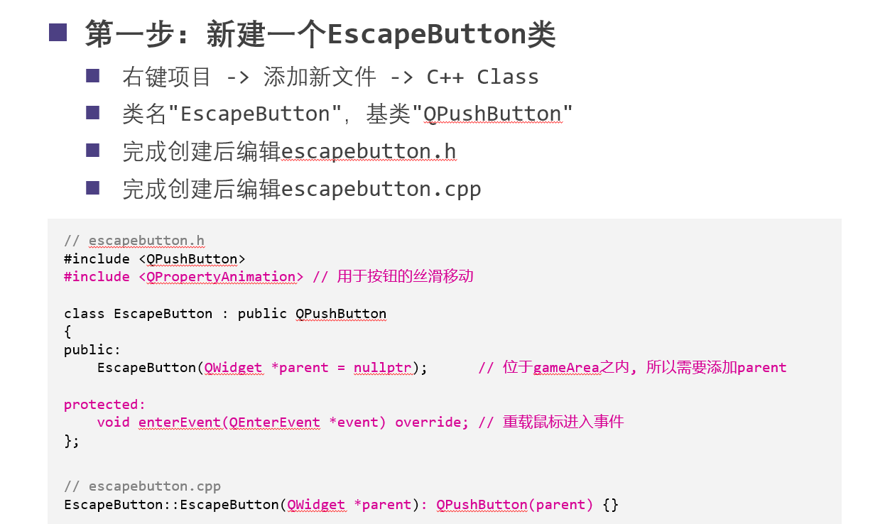

#### 4.2 实现动画移动
使用 `QPropertyAnimation` 为 `pos` 属性添加动画效果。

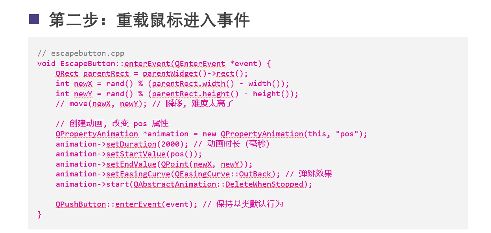

#### 4.3 组件提升
在 Designer 中将原按钮提升为自定义的 `EscapeButton`。

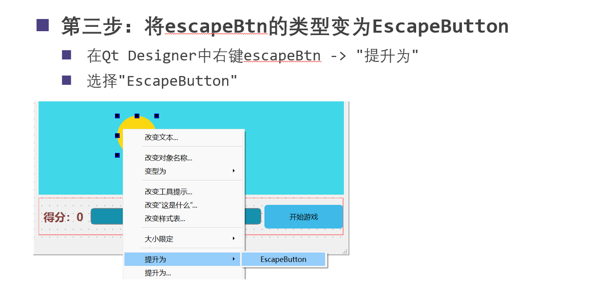

### 5 界面美化进阶

#### 5.1 准备贴图素材

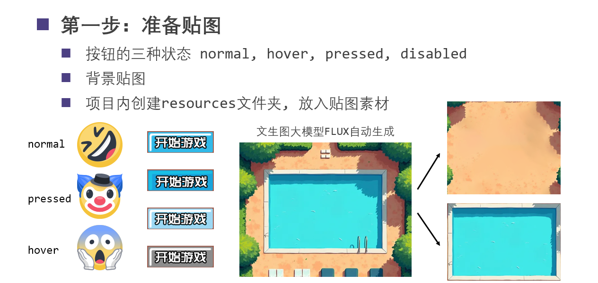

#### 5.2 添加资源文件 (.qrc)
创建资源文件并添加前缀，使图片编译进工程。

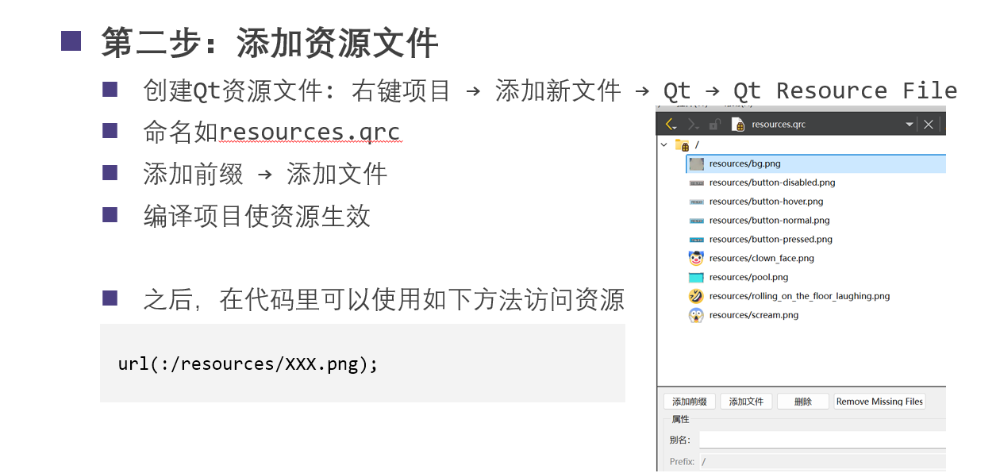

#### 5.3 样式表最终美化
使用 `border-image` 配合资源路径 `url(:/resources/XXX.png)`。

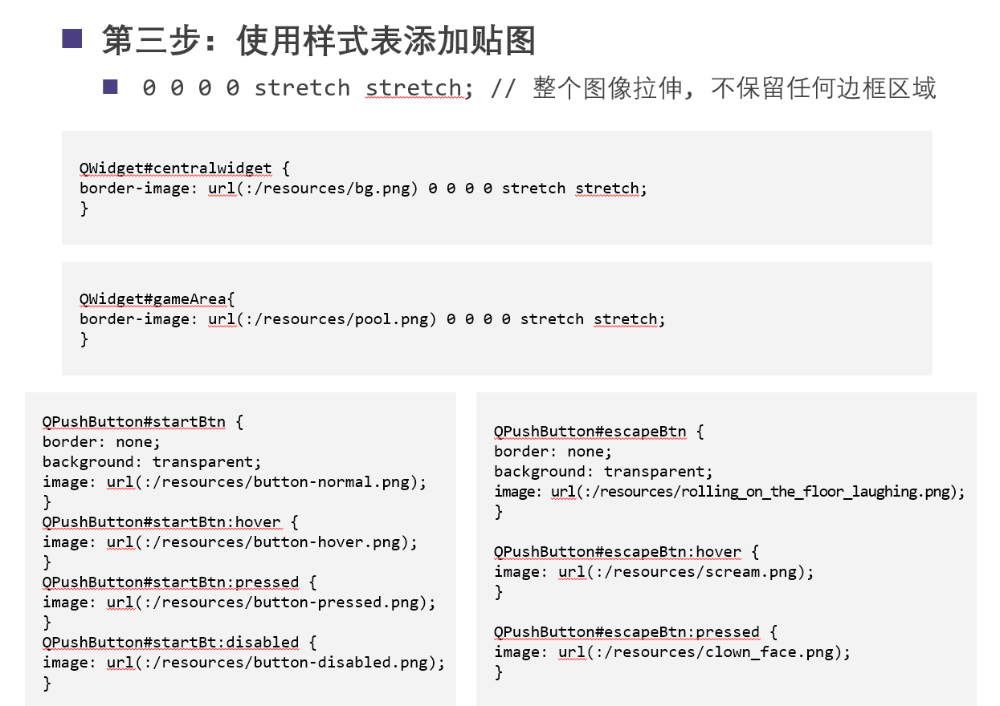

### 6 最终效果展示

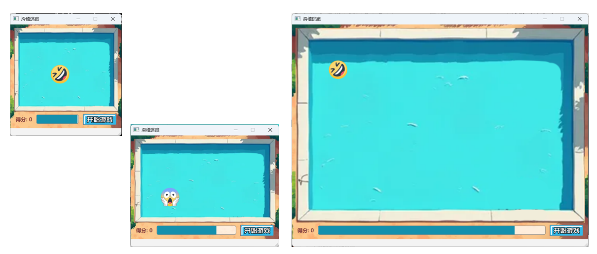
