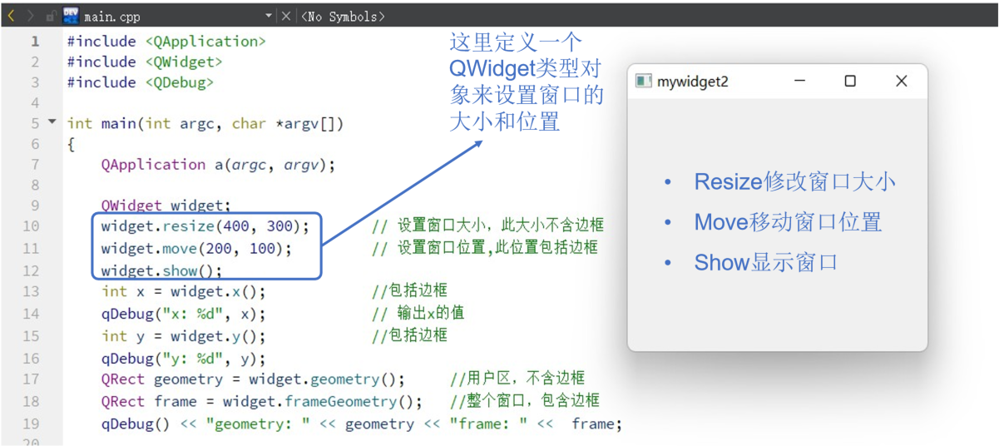
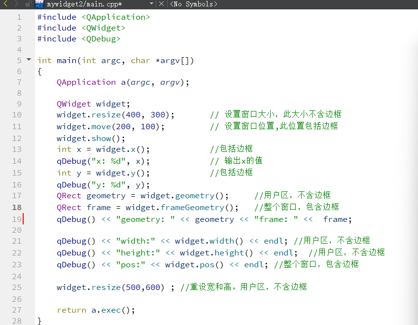
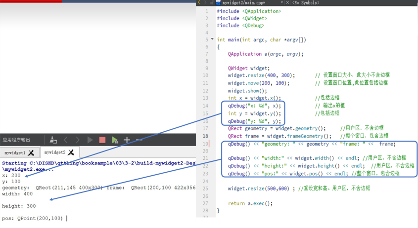

## 示例2 大小位置修改

[讲解视频链接](http://39.96.165.147/Projects/QT-video/sample_2.mp4)

本示例演示如何修改窗口大小、位置，并介绍qDebug

- 如何修改窗口大小、位置
- qDebug的介绍

### 1 如何修改窗口大小、位置

### 2 qDebug的使用

以下代码演示了如何使用qDebug

- 文件前 #include \<QDebug\>
- 利用qDebug在控制台console打印调试信息,  类似C语言的 printf和C++的cout的结合

注意: qDebug可输出的类型也有QString等QT中独有的类, 也可以通过重载运算符打印自己定义的class，常用来程序的调试

**要求的调试信息在控制台中打印效果如下**

### 本示例代码下载链接

[代码下载链接](https://github.com/PKUpop/QT-page/raw/main/code/2.zip)