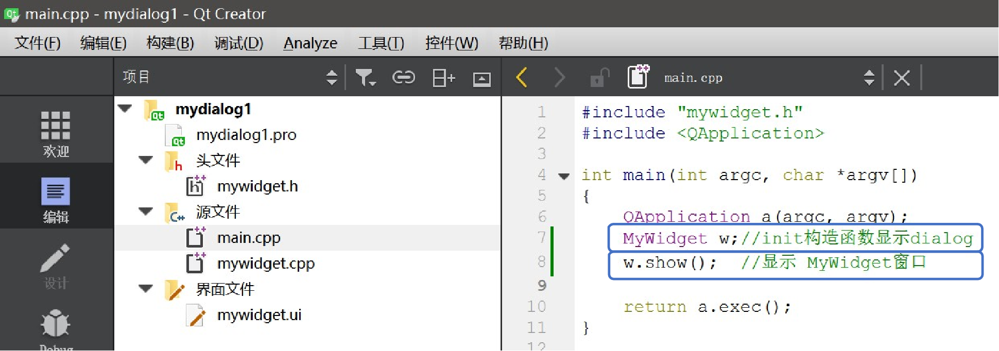
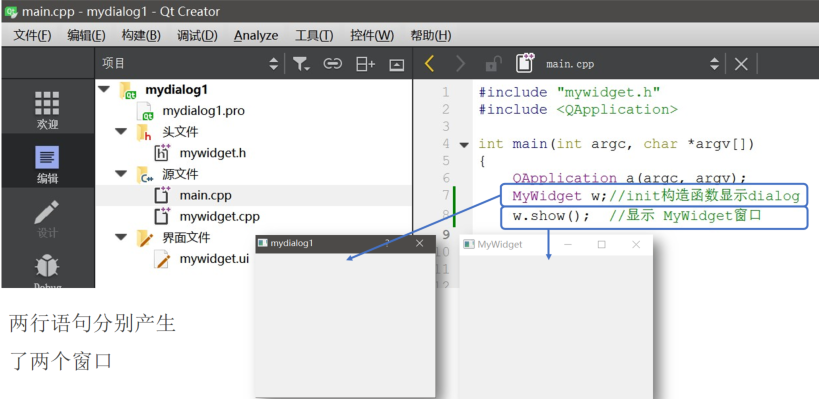
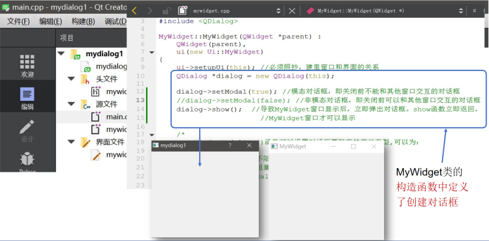
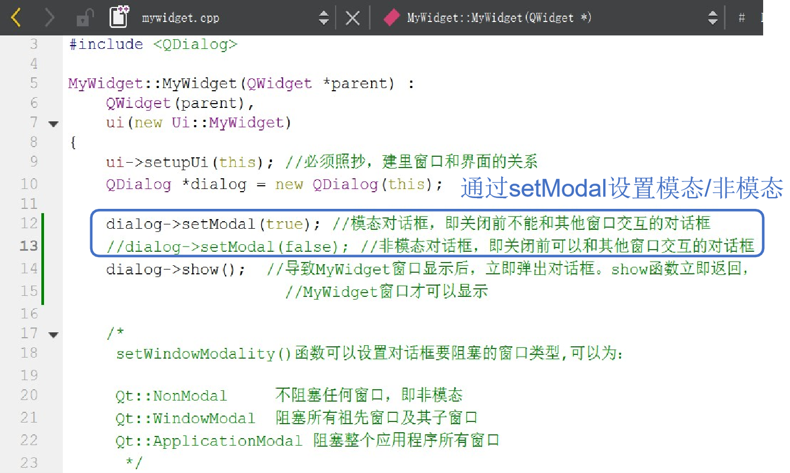
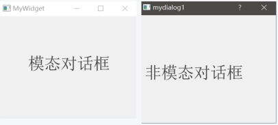

## 示例3 模态与非模态对话框

本示例演示对话框的模态与非模态设置。

### 1 模态对话框

#### 1.1 定义

阻断了用户输入, 当一个模态对话框打开时, 用户只能与该对话框交互, 而其他界面对象收不到输入信息

#### 1.2 举例

关机时弹出的对话框, 会禁止用户对其他窗口进行操作, 必须取消这个对话框才能对其他对话框进行操作

### 2 非模态对话框

#### 2.1 定义

类似普通的windows窗口, 在非模态对话框打开时, 用户可同时打开其他窗口, 操作完毕后, 又可用鼠标或者其他方式激活该窗口

#### 2.2 举例

操作系统中不同窗口的切换

### 3 对话框的模态与非模态设置

**以上两行语句分别产生了两个窗口**

**注意：这里第一行语句之所以会产生窗口是因为MyWidget类的构造函数中定义了创建对话框**

#### 3.1 模态与非模态对话框的设置方法

通过setModal设置模态/非模态：

- (True) 模态对话框：弹出以后原窗口不能交互
- (False) 非模态对话框：弹出以后原窗口还能交互

**设置结果为：**

**注意：这里由于设置了dialog为模态对话框, 则关闭dialog之前不能与widget交互！！！**