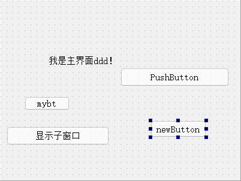
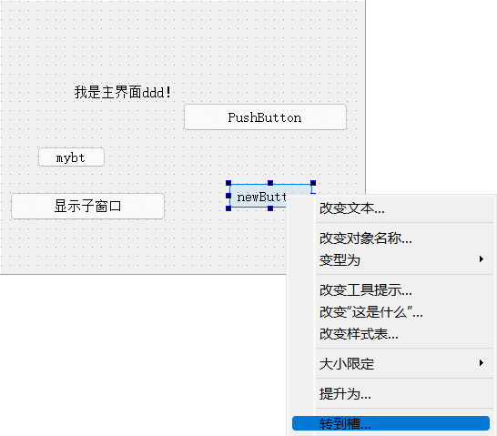
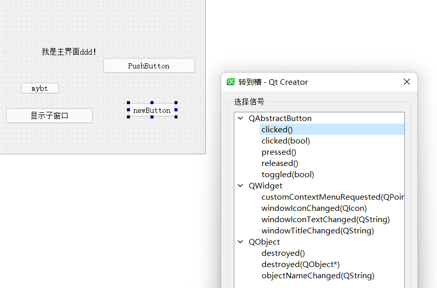
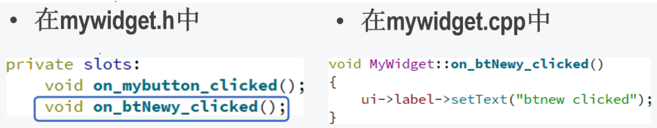
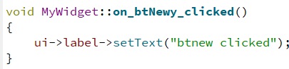
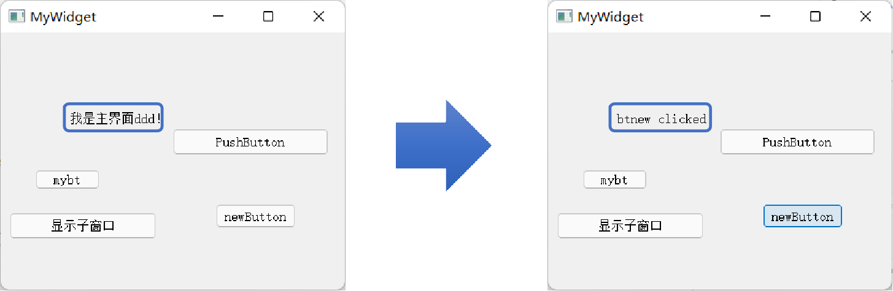

## 示例4 信号和槽的自动关联

[讲解视频链接](http://39.96.165.147/Projects/QT-video/sample_4.mp4)

本示例将首先介绍Qt中信号槽机制，并展示如何通过设计界面，自动实现信号和槽的关联

### 1 Qt中的信号槽机制

#### 1.1 定义

在信号槽机制中, 某个事件发生会广播一个信号，如果一个对象对这个信号有兴趣就会使用连接 (connect) 函数，用自己的一个事件响应函数 (称为slot, 也就是槽) 来处理这个信号。

#### 1.2 举例

以按钮组件为例，在添加一个新的	“newButton” (名为btNewy) 的按钮组件后，通过信号槽机制, 可以实现点击这个按钮执行特定的函数的功能。

### 2 信号和槽的自动关联

信号槽机制的关键,	在于如何让程序知道对于某个信号, 应该调用什么槽函数进行处理, 即信号和槽的关联
**接下来的示例将展示如何通过设计界面,	自动实现信号和槽的关联**

#### 2.1 设置执行特定函数的信号

右键打开按钮组件的菜单栏，点击转到槽

之后会出现一个选择信号的界面，用来选择按钮在什么状态下会执行特定函数。

在达到这种状态时, 按钮组件就会在全局发送一个其他所有组件都能捕获的标识，这就是信号槽机制中的信号。

（这里选择了clicked()信号,表示按钮在被点击时就会向其他组件发送这个信号）

#### 2.2 创建槽函数

在选择好信号后，QtCreator会自动在 MyWidget类中生成一个私有的响应函数on_btNewy_clicked()，捕获到信号后这个函数就会被执行，这个响应函数就叫槽函数。

这里，QtCreator自动生成的槽函数的名字格式是on_xxx_yyy()，其中xxx为发出信号的组件名，yyy为信号名，这里程序判断信号和槽的是否关联的依据也是槽函数的名字

**注意自动生成的槽函数是私有成员函数,只能和类的成员组件发出的信号关联, 所以不会出现命名冲突的问题**

#### 2.3 设置槽函数内容

自动生成的槽函数是没有内容的, 可以给这个函数添加一个改变对话框的文本的行为来进行测试。

可以看到点击newButton后 MyWidget显示的文本按照槽函数的设置进行了改变

### 本示例代码下载链接

[代码下载链接](https://github.com/PKUpop/QT-page/raw/main/code/4.zip)