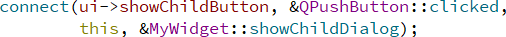
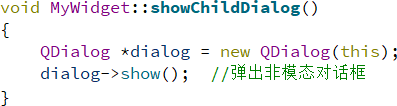
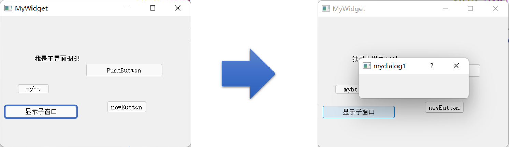

## 示例5 信号和槽的手动关联

上一个示例通过设计界面的“转到槽”功能,	自动进行了信号和槽函数的关联，本示例将展示如何手动进行信号和槽之间的关联。

### 1 connect函数

除了利用QtCreator 自动生成槽函数外，也可以在MyWidget类内部初始化时利用connect函数手动将某个组件的信号与自身成员函数或者其他类的公有成员函数进行关联。

- connect是QObject成员函数，各种类都继承于QObject，用于手动关联信号和槽。
- 指定ui➡showChildButton按钮上的clicked事件将由该对象的showChildDialog响应。

### 2 connect函数的参数

- 第一个参数：发出信号的组件

- 第二个参数：发出的信号，这里设置为点击“显示子窗口”按钮时发出的信号

- 第三个参数：捕获信号的对象，也就是执行槽函数的对象，this指代的MyWidget类

- 第四个参数：槽函数，这里的功能就是new一个新的Qdialog对话框并且显示出来

  

### 3 connect函数运行结果

点击按钮后执行槽函数弹出一个新的对话框

