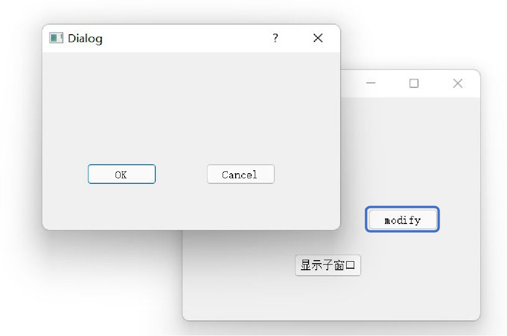
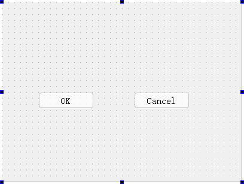
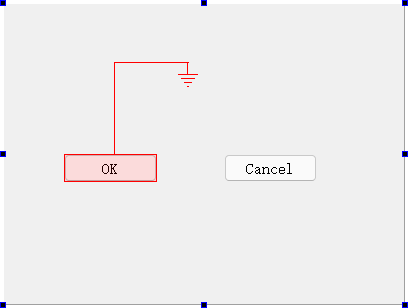
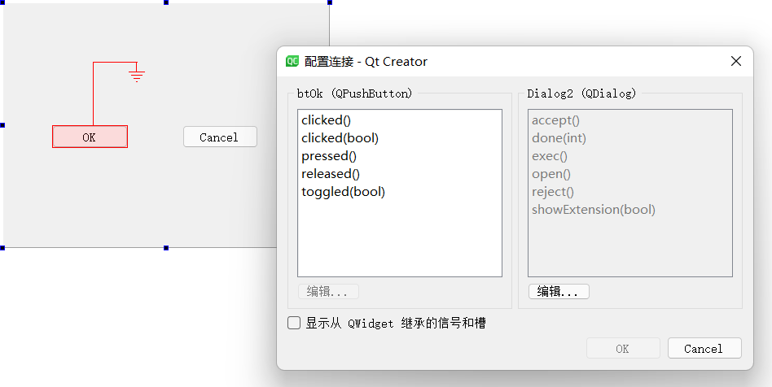
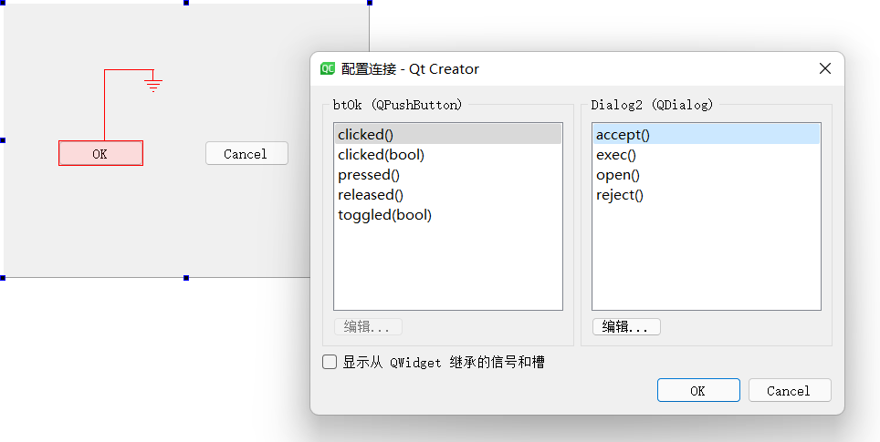
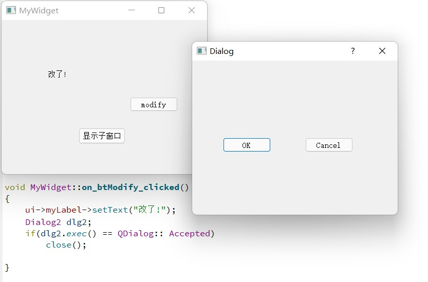

## 示例6 编辑槽映射

[讲解视频链接](http://39.96.165.147/Projects/QT-video/sample_6.mp4)

- 信号槽自动关联中，QtCreator会自动生成槽函数，但也需要自己写槽函数内容
- 信号槽手动关联中，利用connect函数允许随意设置信号和槽的关联，但需要在类的初始化阶段写相应代码，比较麻烦

接下来的示例将展示如何通过在UI设计界面编辑槽映射，实现一个组件的信号和另外组件的槽函数的关联。

### 1 示例效果

本示例的程序由下方的父窗口和上方的对话框组成

点击父窗口中的modify按钮将弹出对话框，接着点击对话框的OK按钮后，对话框与父窗口均会被关闭

本示例将借助编辑槽映射的方式来实现上述效果

### 2 实现过程

#### 2.1 添加按钮

在MyWidget主界面弹出的QDialog类型的对话框添加两个原始的 QPushButton类的按钮组件

#### 2.2 配置连接

1. 点击F4，选中发送信号的组件，拖动连线停在接收信号的组件，这里发送信号的按钮被命名为btOK，接收信号的对话框被命名为Dialog2

2. 松开鼠标后会出现配置连接的选项，可以在这里编辑槽映射

3. 这里选择发送方btOK的信号为clicked()，接收方Dialog2接收到信号后需要执行的槽函数为accept()：

- 行为逻辑变成了点击按钮,按钮会发出信号使对话框执行accept()函数
- accept() 函数会把对话框Dialog2的返回值设置为Accepted成员变量

4. 点击btModify按钮创建并弹出对话框Dialog2，点击Dialog2对话框的btOK按钮, 根据刚才编辑槽映射的结果, Dialog2会执行完毕并返回 Accepted变量

**在这里，过程都发生在btModify的槽函数中,这是MyWidget类的成员函数，所以当Dialog2对话框返回Accepted时,槽函数执行close()，主页面MyWidget也随之关闭。**

### 本示例代码下载链接

[代码下载链接](https://github.com/PKUpop/QT-page/raw/main/code/6.zip)