## 示例7 常用对话框介绍

本示例介绍以下八个常用的对话框：

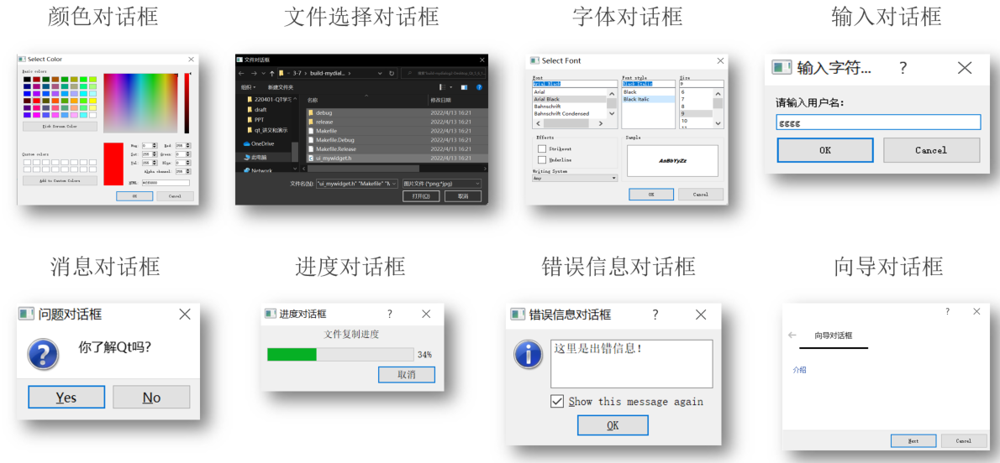

### 1 颜色对话框

QColorDialog为Qt中的颜色对话框类设置Qt::red为默认选择的颜色

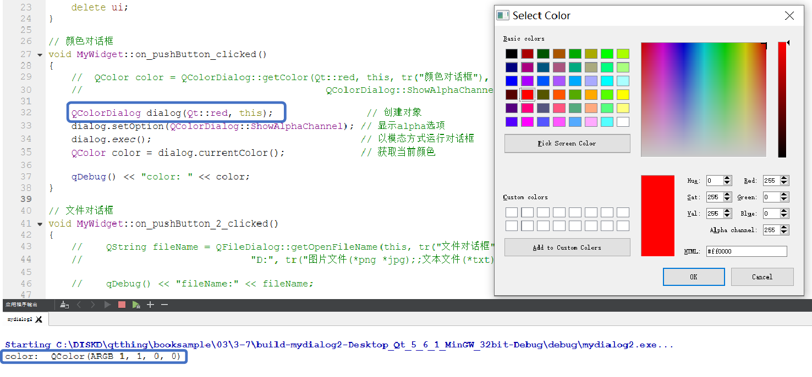

### 2 文件选择对话框

可以同时选择多个文件，并输出所有文件名

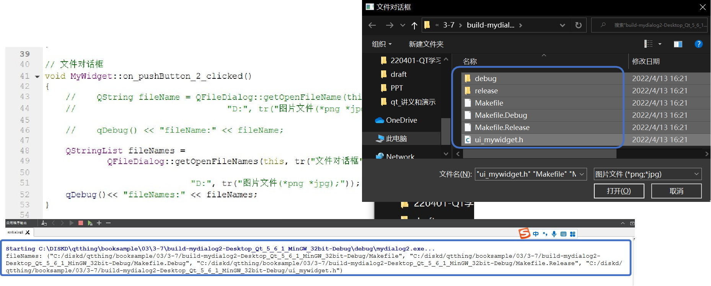

### 3 字体对话框

选择某种字体后，对应文字的字体会发生改变

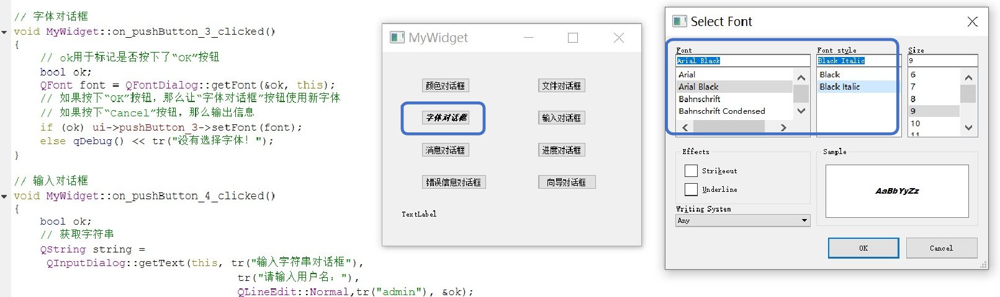

### 4 输入对话框

- 对话框1：输入字符串对话框
- 对话框2：输入整数/浮点数对话框
- 对话框3：输入条目对话框

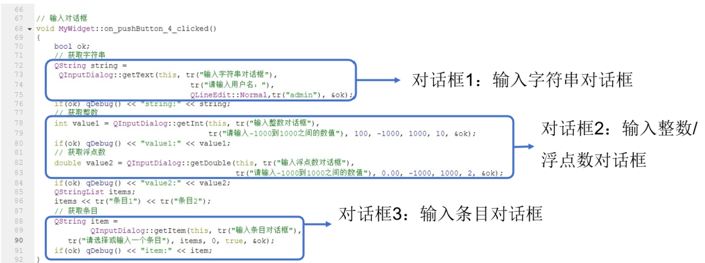

**输入对话框效果**

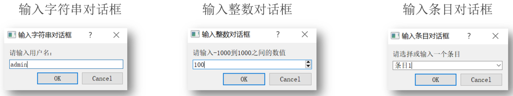

### 5 消息对话框

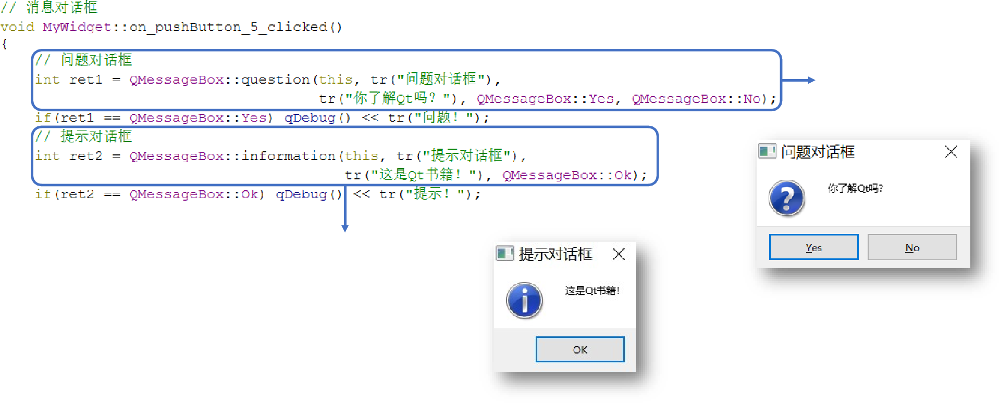

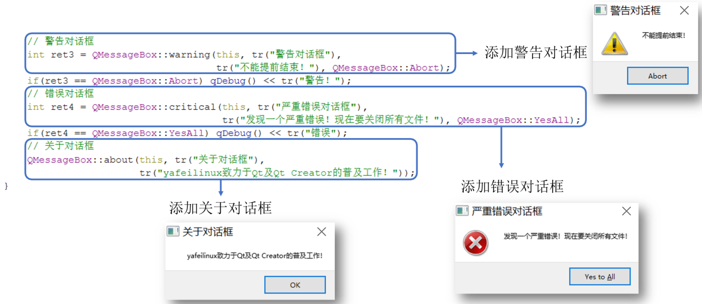

### 6 进度对话框

### 7 错误信息对话框

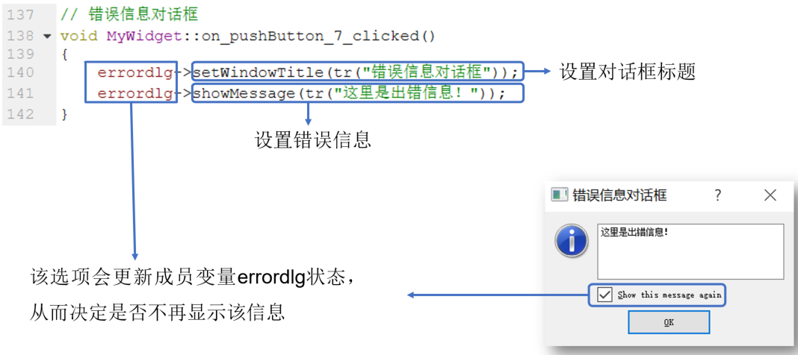

### 8 向导对话框

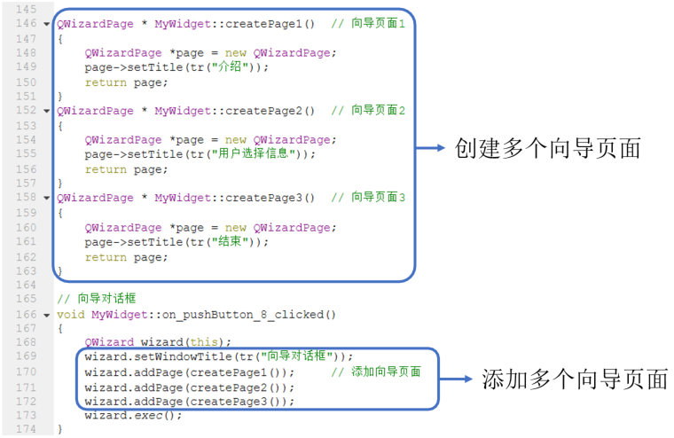

**向导对话框效果**

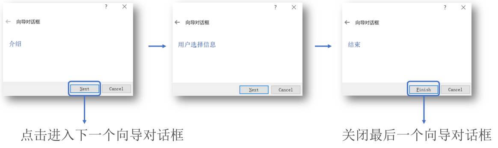

### 本示例代码下载链接

[代码下载链接](https://github.com/PKUpop/QT-page/raw/main/code/7.zip)