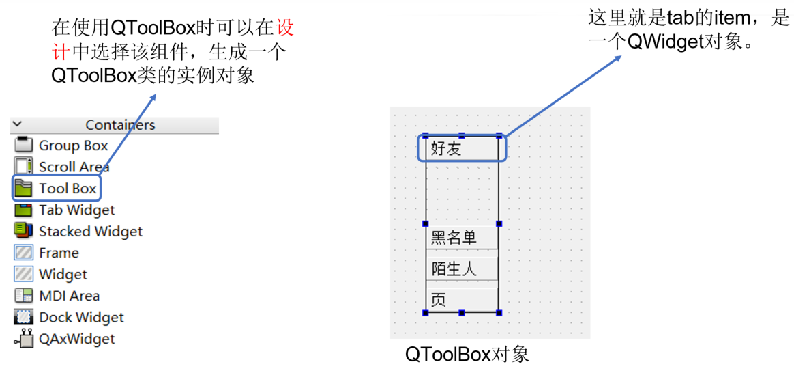
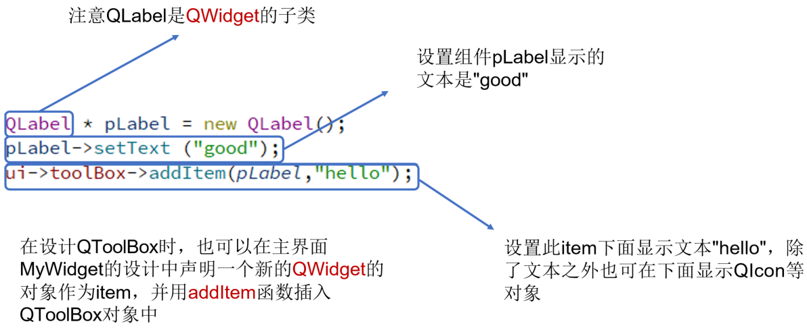
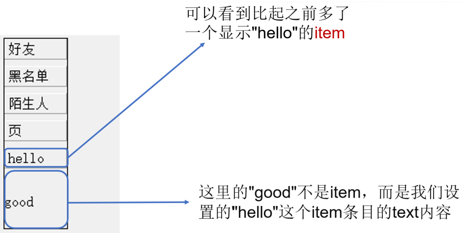
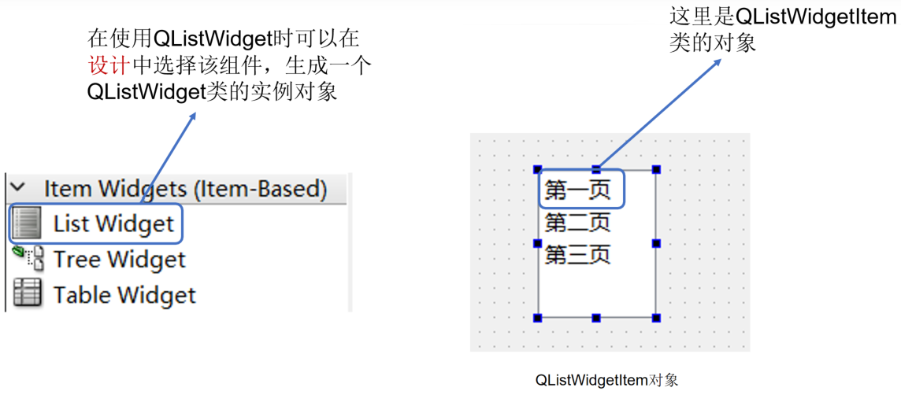
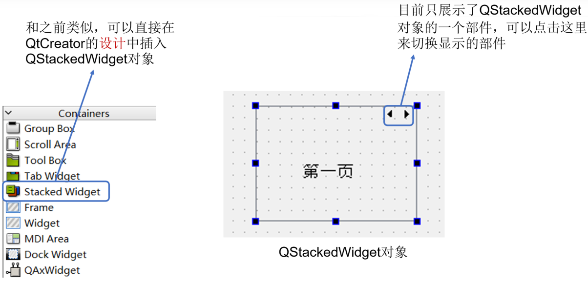
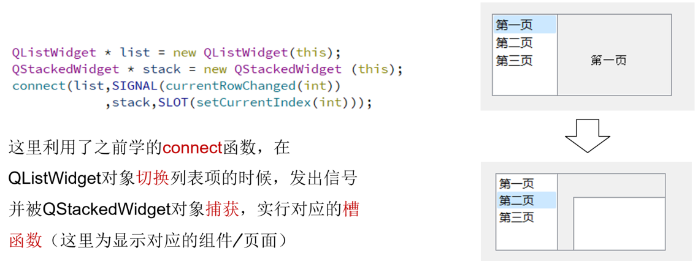

## 示例8 常用组件介绍

本实例将演示QToolBox, QListWidget, QStackedWidget三种常用组件。

### 1 QToolBox

#### 1.1 简介

1. QToolBox类提供了一个列（选项卡式的）部件条目
2. QToolBox可以在一个tab列上显示另外一个，并且当前的item显示在当前的tab下面。
3. 每个tab都在tab列中有一个索引位置
4. tab的item是一个QWidget

#### 1.2 使用QToolBox

- 在使用QToolBox时可以在设计中选择该组件，生成一个 QToolBox类的实例对象

QToolBox对象也可以在MyWidget中声明，具体细节可参考： https://blog.csdn.net/liang19890820/article/details/52439711

- 在设计QToolBox时，也可以在主界面 MyWidget的设计中声明一个新的QWidget的对象作为item，并用addItem函数插入 QToolBox对象中

- 设置结果如下图所示，可以看到比起之前多了一个显示"hello"的item

### 2 QListWidget

#### 2.1 简介

1. QListWidget类列表框控件用来加载并显示多个列表项
2. QListWidget对象中可以添加QListWidgetItem类型作为列表项， QListWidgetItem类的设置与之前的QToolBox类似

#### 2.2 使用QListWidget

- 在使用QListWidget时可以在设计中选择该组件，生成一个QListWidget类的实例对象

若想学习QListWidget和后面要学的QStackedWidget对象更多细节可参考：
https://blog.csdn.net/l09711/article/details/7315979

### 3 QStackedWidget

#### 3.1 简介

1. QStackedWidget可实现同一界面切换不同的窗口，直接切换就可以显示不同子窗口的内容
2. QStackedWidget类往往可以和QListWidget类共同完成界面的切换

#### 3.2 使用QStackedWidget

- 和之前类似，可以直接在 QtCreator的设计中插入 QStackedWidget对象

- QStackedWidget对象切换部件比较常用的一种方法是和QListWidget对象的列表项进行关联，通过QListWidget对象列表项的选择切换组件

这里利用了之前学的connect函数，在 QListWidget对象切换列表项的时候，发出信号并被QStackedWidget对象捕获，实行对应的槽函数（这里为显示对应的组件/页面）

### 本示例代码下载链接

[代码下载链接](https://github.com/PKUpop/QT-page/raw/main/code/8.zip)