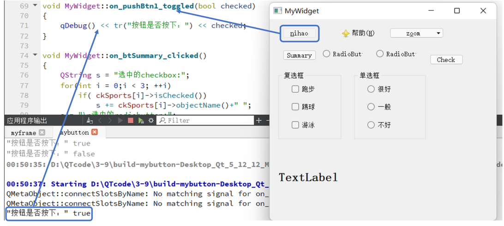
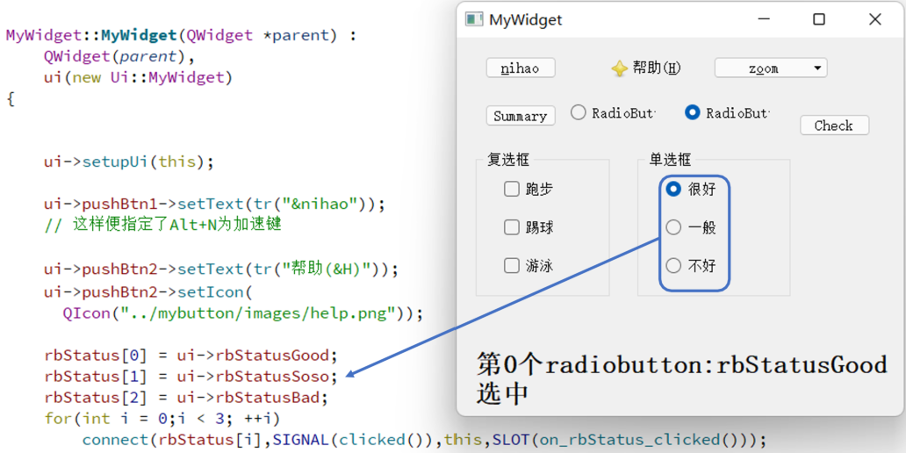
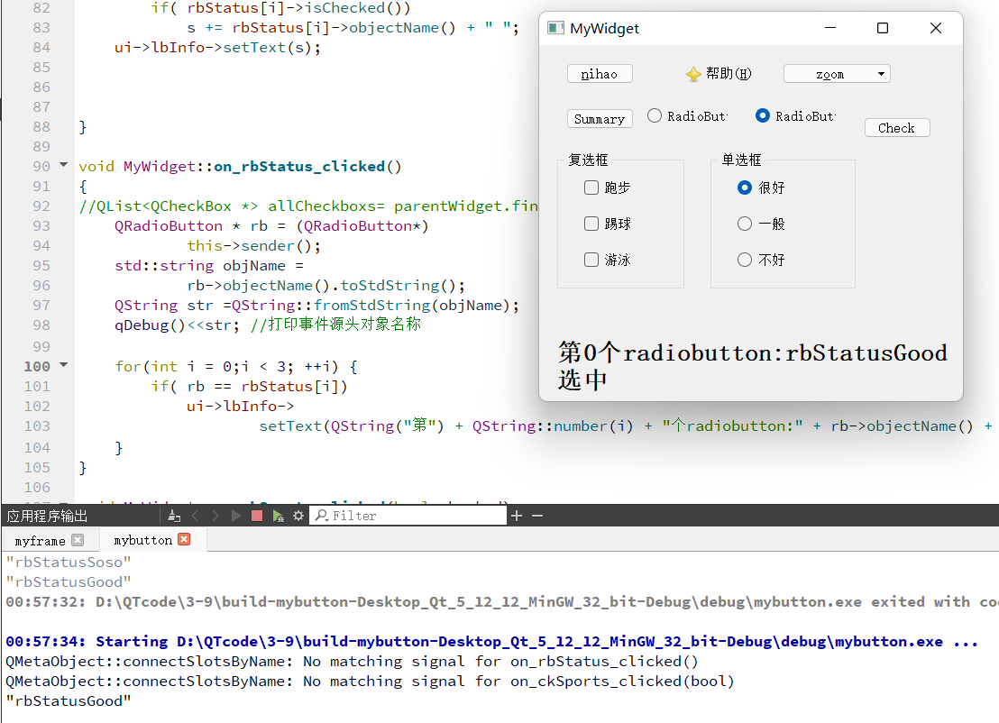
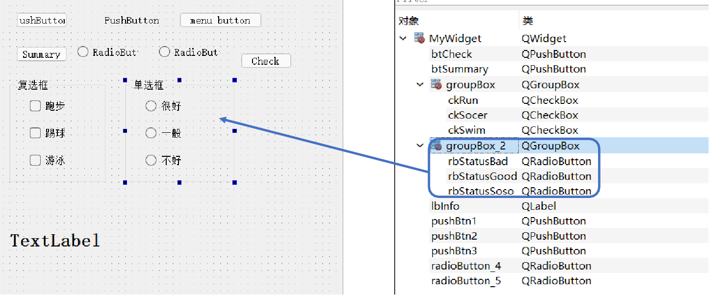
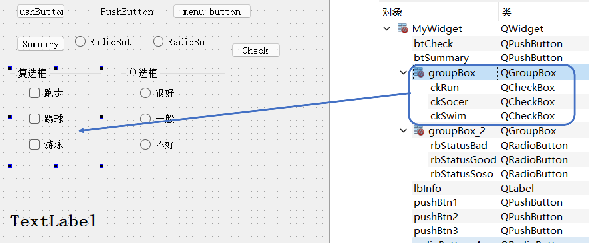
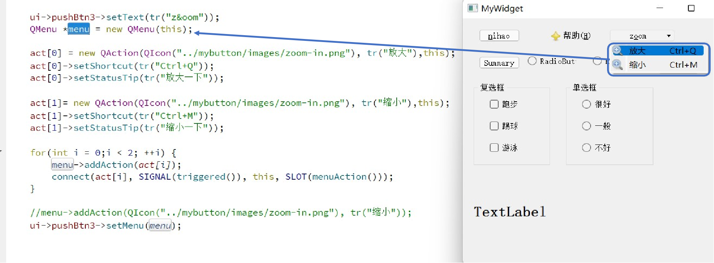
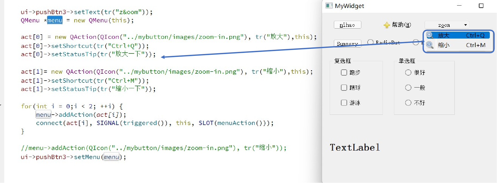
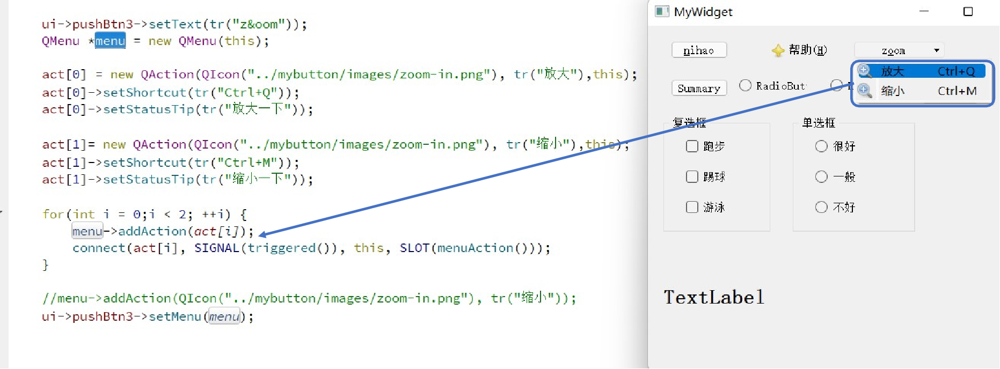
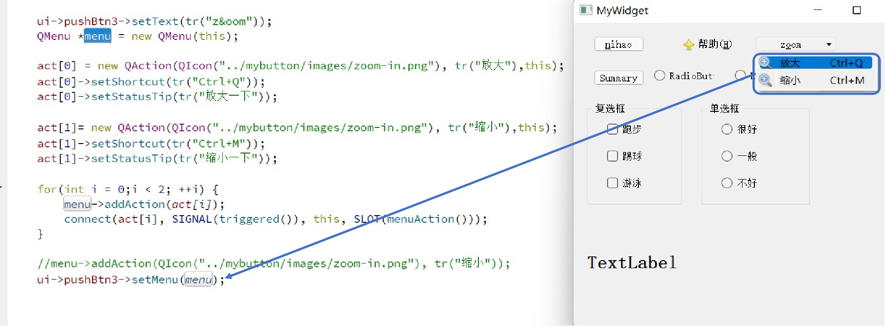

## 示例9 常用按钮介绍

该示例将演示不同的按钮，按钮数组，按钮带menu等

### 1 QPushButton

QPushButton是最基本的按钮，一般在点击（click）时发出信号触发槽函数，建立槽映射的方法可参照示例5~7

### 2 QRadioButton

QRadioButton是单选按钮，除了点击后可发出信号触发槽函数外，也会记录是否选中了这个按钮

在点击QRadioButton对象后，触发了槽函数，打印了该按钮的名字并且还对主界面利用 setText函数进行文本的更新

注意：这里是一个 QRadioButton对象数组，数组在对象 QGroupBox中，所有 QRadioButton对象只能有一个被选中

### 3 QCheckBox

复选框和单选框用法类似，不过复选框 QCheckBox对象数组中的所有对象都是可以同时选中的

### 4 QMenu

这里为了给按钮提供菜单功能，先声明一个QMenu类的对象，这个类顾名思义是菜单类

act数组是之前声明好的QAction类，这里设置了放大和缩小两种行为。

设置好后便把act数组利用addAction函数添加到QMenu对象中，并利用connect把menu的action和槽函数 SLOT(menAction())关联

最后只需要把已经设置好的QMenu对象利用setMenu函数和按钮关联即可

### 本示例代码下载链接

[代码下载链接](https://github.com/PKUpop/QT-page/raw/main/code/9.zip)